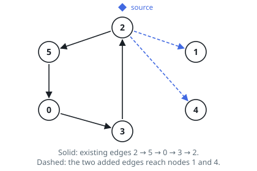
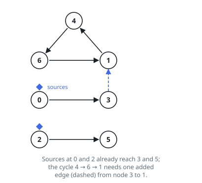

# Fewest Edges to Reach Every Node from a Source

## Description

You are given `n` nodes numbered `0` to `n - 1`. The array `sources`
lists the nodes that carry a mark, and the parallel arrays `edgeFrom`
and `edgeTo` describe the directed edges already in place: for each
index `i`, an edge runs from `edgeFrom[i]` to `edgeTo[i]`.

A node is *covered* when it is marked, or when a path of one or more
edges leads to it from some marked node.

Return the fewest new directed edges needed so that every node is
covered.

### Example 1

```text
Input: n = 6, sources = [2], edgeFrom = [2,5,0,3], edgeTo = [5,0,3,2]
Output: 2
Explanation: Nodes 2, 5, 0, 3 form a directed cycle, and the mark on
node 2 travels around it, covering all four. Nodes 1 and 4 have no
edges at all, so each needs a new edge pointing at it — two in total,
both drawn from node 2.
```



### Example 2

```text
Input: n = 7, sources = [0,2], edgeFrom = [4,6,1,0,2], edgeTo = [6,1,4,3,5]
Output: 1
Explanation: The marks on nodes 0 and 2 cover nodes 3 and 5 through the
existing edges. The cycle 4 -> 6 -> 1 -> 4 is entered by nothing, and a
single new edge from the covered node 3 into the cycle covers all three
of its nodes.
```



### Example 3

```text
Input: n = 4, sources = [2], edgeFrom = [2,2,1], edgeTo = [1,3,0]
Output: 0
Explanation: Node 2 covers 1 and 3 directly, and node 0 one step
farther. Every node is already covered, so nothing needs adding.
```

### Constraints

- `2 <= n <= 10⁵`
- `1 <= sources.length <= n`
- `0 <= sources[i] <= n - 1`
- `1 <= edgeFrom.length == edgeTo.length <= min(2 · 10⁵, n · (n - 1) / 2)`
- `0 <= edgeFrom[i], edgeTo[i] <= n - 1`
- `edgeFrom[i] != edgeTo[i]`
- no two existing edges join the same pair of nodes in the same
  direction

## Hints

### Hint 1

Nodes locked in one directed cycle can each reach all the others, so
each maximal group of mutually reachable nodes can be treated as a
single unit. What does the graph look like after that contraction?

### Hint 2

In the contracted graph, a unit is covered exactly when it holds a mark
or has a mark somewhere upstream of it.

### Hint 3

Every uncovered unit with no incoming unit is a leak that no existing
edge can fill, and one new edge aimed at such a leak fixes its whole
downstream. Count the leaks.
