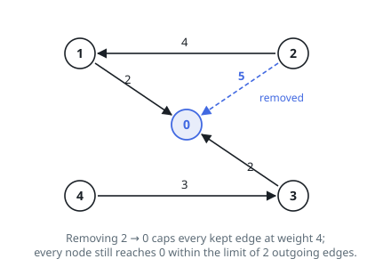
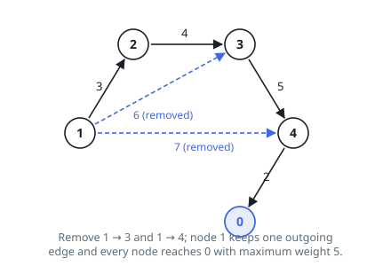

# Least Weight Cap for Reaching Node Zero

## Description

You are given two integers `n` and `threshold`, and a directed weighted graph
whose `n` nodes are numbered `0` to `n - 1`. The array `edges` describes it:
`edges[i] = [ai, bi, wi]` is an edge running from node `ai` to node `bi` with
weight `wi`.

Delete edges from the graph — as many as you like, or none — until what
remains satisfies both conditions:

- every node can still travel to node `0` along directed edges, and
- no node keeps more than `threshold` outgoing edges.

Among all subgraphs that qualify, find the smallest possible value of the
heaviest remaining edge weight, and return it. If no deletion can satisfy the
two conditions, return `-1`.

### Example 1

```text
Input: n = 5, edges = [[1,0,2],[2,0,5],[3,0,2],[4,3,3],[2,1,4]], threshold = 2
Output: 4
Explanation: Remove the edge 2 -> 0. Every node then reaches node 0 — 2 goes
through 1 — and the heaviest surviving edge is 2 -> 1 with weight 4.
```



### Example 2

```text
Input: n = 4, edges = [[0,1,2],[1,2,3],[2,3,4]], threshold = 1
Output: -1
Explanation: Every edge points away from node 0, so nodes 1, 2, and 3 can
never reach it.
```

### Example 3

```text
Input: n = 5, edges = [[1,2,3],[1,3,6],[1,4,7],[2,3,4],[3,4,5],[4,0,2]], threshold = 1
Output: 5
Explanation: Remove the edges 1 -> 3 and 1 -> 4, leaving node 1 with a single
outgoing edge. The surviving chain 1 -> 2 -> 3 -> 4 -> 0 has heaviest edge
3 -> 4 with weight 5, and no cheaper detour exists.
```



### Example 4

```text
Input: n = 5, edges = [[1,2,3],[1,3,6],[1,4,7],[2,3,4],[4,0,2]], threshold = 1
Output: -1
Explanation: Node 3 has no outgoing edge at all, so it can never reach
node 0.
```

### Constraints

- `2 <= n <= 10⁵`
- `1 <= threshold <= n - 1`
- `1 <= edges.length <= min(10⁵, n * (n - 1) / 2)`
- `edges[i].length == 3`
- `0 <= ai, bi < n`
- `ai != bi`
- `1 <= wi <= 10⁶`
- A pair of nodes may be joined by several edges, but their weights differ.

## Hints

### Hint 1

Phrase the goal as a yes/no question about a candidate cap `x`: keeping only
edges of weight at most `x`, can every node still reach node `0`? How does
the answer move as `x` grows?

### Hint 2

Turn every edge around. "Everyone can reach node `0`" becomes "node `0` can
reach everyone", which one sweep from a single start settles.

### Hint 3

Check the outgoing-edge cap against a witness of reachability: a traversal
tree needs just one outgoing edge per node, so the cap never decides the
answer on its own.
