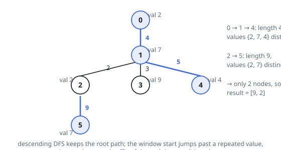

# Solutions — Longest Duplicate-Free Descent

## DFS carrying a sliding distinct-value window

Every duplicate-free descent is a downward route, so a single depth-first
walk from the root meets them all: while descending, hold the current
root-to-node route together with its prefix distances, `dist_path[t]` being
the distance from the root to the node at depth `t`. A descent ending at the
current node is a trailing stretch of that route, so once the shallowest
permitted start depth is known, its length reads in constant time as
`d - dist_path[start]`.

That start depth is governed by a dictionary `last`, mapping each value to
the depth of its most recent appearance on the current route, plus the
current window start `start_depth`. Entering a node whose value `val` last
appeared at depth `prev_last`, the window has to jump past that appearance
whenever it lies inside it (`prev_last >= start_depth`), setting
`start_depth = prev_last + 1`. The start only moves deeper while descending —
the left pointer of a sliding window, in tree form. The candidate ending here
measures `d - dist_path[start_depth]` over `depth - start_depth + 1` nodes;
keep the best length and, among ties, the smallest node count.

Because the walk backtracks, the window state must be restored on the way
out. Before entering a node, the code stashes the node's previous `last`
entry, the previous `start_depth`, and the route tail; an explicit exit event
on the stack puts them back. The traversal itself is iterative — every node
is pushed once as an enter event and once as an exit event — because at
`n = 5 * 10⁴` a recursive walk would overflow.

Worked on example 1 (`nums = [2,7,2,9,4,7]`): node 2's value `2` repeats the
root's, so the window past depth 0 and the best descent ending at 2 is 1 -> 2
of length 2. Node 5's value `7` repeats node 1's at depth 1, pushing the
start to depth 2 and leaving the single edge 2 -> 5, worth 9 over two nodes —
which ties the three-node descent 0 -> 1 -> 4 and wins the node count.

Edge behaviour: a lone node always qualifies, so the answer starts at
`[0, 1]`, covering the two-node collision tree of example 2; repeats at
depths outside the current window never move the start; and the tie-break
naturally prefers the shorter route of equal length.

**Complexity:** `O(n)` time, `O(n)` space.
