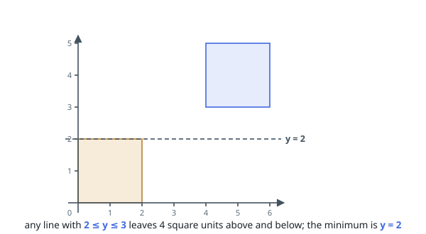
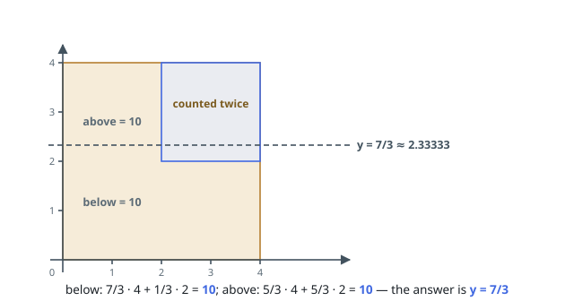

# Halve the Square Area Sum

## Description

You are given an array `squares` of axis-aligned squares. Entry
`squares[i] = [xi, yi, li]` gives the bottom-left corner `(xi, yi)` and the
side length `li`.

Squares may overlap. Each square's area counts on its own, so a region
covered by two squares counts twice.

A horizontal line at height `y` leaves some part of every square below it.
Find the smallest `y` at which the total area below the line equals the
total area above it, and return that height.

An answer within `10⁻⁵` of the true value is accepted.

### Example 1

```text
Input: squares = [[5,7,3]]
Output: 8.50000
Explanation: A lone square of area 9 is split evenly by the line through its
mid-height, 7 + 1.5 = 8.5.
```

### Example 2

```text
Input: squares = [[0,0,2],[4,3,2]]
Output: 2.00000
Explanation: The two squares are disjoint and equal, so each side of the
line must hold area 4. Every line with 2 <= y <= 3 does that — the lower
square is fully below and the upper fully above — and the smallest such
height is 2.
```



### Example 3

```text
Input: squares = [[0,0,4],[2,2,2]]
Output: 2.33333
Explanation: The smaller square sits inside the larger, and the region they
share is counted for both. The total is 16 + 4 = 20, and the line y = 7/3
leaves 4 · 7/3 + 2 · 1/3 = 10 below and equally much above.
```



### Constraints

- `1 <= squares.length <= 5 * 10⁴`
- `squares[i].length == 3`
- `0 <= xi, yi <= 10⁹`
- `1 <= li <= 10⁹`
- the areas of all squares together sum to at most `10¹²`

## Hints

### Hint 1

Raising the line can only move area from the above side to the below side.
What classic technique does a quantity that moves only one way invite?

### Hint 2

Testing a height is a single pass: a square whose vertical span runs from
`yi` to `yi + li` contributes `li` times the overlap of that span with
everything below the line.

### Hint 3

Each test is cheap and exact, so a few dozen bisection steps shrink the
candidate interval far below the accepted tolerance.
