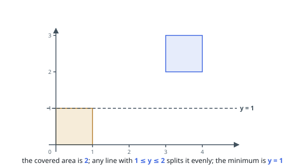
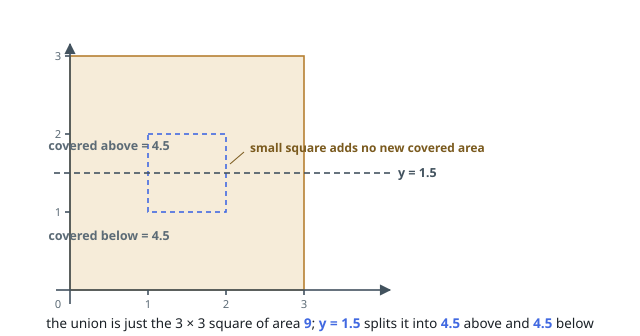

# Halve the Square Area Union

## Description

You are given an array `squares` of axis-aligned squares. Entry
`squares[i] = [xi, yi, li]` gives the bottom-left corner `(xi, yi)` and the
side length `li`.

Squares may overlap. Measure the covered region: a point counts once, no
matter how many squares lie on top of it.

A horizontal line at height `y` splits the covered region into the part below
the line and the part above. Find the smallest `y` at which those two parts
have equal area, and return that height.

An answer within `10⁻⁵` of the true value is accepted.

### Example 1

```text
Input: squares = [[0,0,1],[3,2,1]]
Output: 1.00000
Explanation: The squares are disjoint, so together they cover area 2. Every
line with 1 <= y <= 2 leaves exactly 1 covered unit on each side, and the
smallest such height is 1.
```



### Example 2

```text
Input: squares = [[0,0,3],[1,1,1]]
Output: 1.50000
Explanation: The unit square lies wholly inside the 3 by 3 square, so it adds
nothing to the covered region. The union is a single square of area 9,
halved by the line at its mid-height 1.5.
```



### Example 3

```text
Input: squares = [[0,0,4],[3,3,2]]
Output: 2.37500
Explanation: The 2 by 2 square overlaps the top-right corner of the 4 by 4,
so the union covers 16 + 4 - 1 = 19. Below height 3 only the big square is
present, its strip contributing area 4y, and 19/2 = 9.5 is reached at
y = 2.375.
```

### Constraints

- `1 <= squares.length <= 5 * 10⁴`
- `squares[i].length == 3`
- `0 <= xi, yi <= 10⁹`
- `1 <= li <= 10⁹`
- the covered region spans at most `10¹⁵` units of area

## Hints

### Hint 1

The width of the covered strip only changes where some square begins or
ends. Which heights are worth visiting, and in what order?

### Hint 2

At a fixed height you need the length of the union of the active squares'
x-spans. Coordinate-compress the x-coordinates and keep a per-node coverage
count in an interval tree so each square enters and leaves in logarithmic
time.

### Hint 3

Every band between neighboring heights has constant width, so its area is an
exact integer. When the running area first reaches half the total inside a
band, one linear equation locates the line — and only that step divides.
