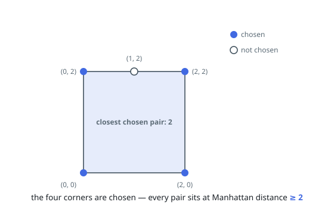
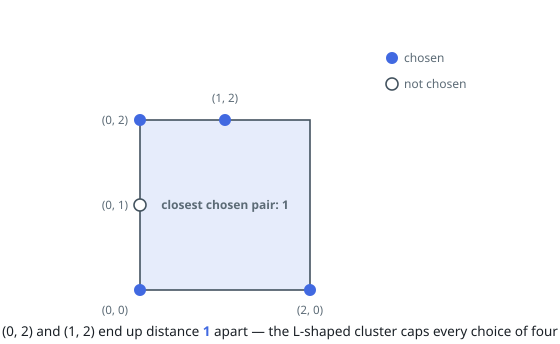
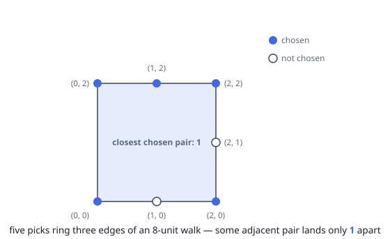

# Most Separated Points on a Square Boundary

## Description

You are given an integer `side`. A square on the Cartesian plane has corners
`(0, 0)`, `(0, side)`, `(side, 0)` and `(side, side)`.

You are also given an array `points` of coordinates lying on the square's
boundary, and a positive integer `k`.

Choose exactly `k` of the points so that the closest chosen pair is as far
apart as possible, measured by Manhattan distance, and return that largest
achievable closest-pair distance.

The Manhattan distance between `(xi, yi)` and `(xj, yj)` is
`|xi - xj| + |yi - yj|`.

### Example 1

```text
Input: side = 2, points = [[0,0],[2,0],[1,2],[0,2],[2,2]], k = 4
Output: 2
Explanation: Choose the four corners. Neighboring corners are 2 apart and
opposite ones 4, so the closest pair is 2. Nothing beats that here: walking
the whole boundary covers 8 units, and cutting it into four stretches forces
one stretch of at most 2.
```



### Example 2

```text
Input: side = 2, points = [[0,0],[2,0],[0,1],[0,2],[1,2]], k = 4
Output: 1
Explanation: Four of the five points hug the left and top edges in a chain
with consecutive points 1 apart, and at most two of them can be mutually
2 apart. Whichever four you keep, two sit at distance 1 — here (0, 2) and
(1, 2).
```



### Example 3

```text
Input: side = 2, points = [[0,0],[1,0],[2,0],[2,1],[2,2],[1,2],[0,2]], k = 5
Output: 1
Explanation: Seven points ring the boundary. Five chosen ones cut the
8-unit walk into five stretches summing to 8, so some stretch is at most 1 —
as with the chosen set here, where (2, 2) and (1, 2) are neighbors.
```



### Constraints

- `1 <= side <= 10⁹`
- `4 <= points.length <= min(4 * side, 15 * 10³)`
- every `points[i] = [xi, yi]` lies on the boundary of the square
- all points are distinct
- `4 <= k <= min(25, points.length)`

## Hints

### Hint 1

Two boundary points are close in Manhattan distance exactly when they are
close along the rim. What single number per point encodes its place on the
rim?

### Hint 2

"Every chosen pair at least `d` apart" is a property that survives lowering
`d` — and the largest useful `d` cannot exceed half the perimeter walk.

### Hint 3

To test one `d`, walk the rim clockwise from each candidate starting point,
always hopping to the next point at least `d` further along; a chain of `k`
hops that closes back on itself proves `d` reachable.

### Hint 4

Unrolling the rim into a doubled sorted list turns "next point at least `d`
along" into a binary search, and the closing condition into a window check.
