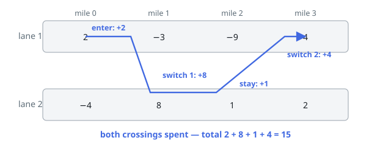

# Solutions — Richest Two-Lane Ride

## Rolling lane DP with a crossing budget

A ride advances exactly one stretch per move, so at each mile the only facts
that matter are which lane the vehicle occupies and how many crossings
remain — six states in all. Let `dp[lane][r]` be the best total of a ride
ending at the current stretch in that lane with `r` crossings still unused.
Consecutive stretches connect the states locally: staying in a lane costs
nothing, crossing decrements `r`, and in both cases the new stretch's fare
of the arrival lane is added. Rolling arrays of three entries per lane carry
everything.

Two injection and extraction rules complete the model. A ride may begin at
any stretch, so every stretch seeds two fresh states: start in lane 1 with
the full budget (`cur1[2] = v1`), or start and cross at once with one
crossing spent (`cur2[1] = v2`) — the immediate crossing is legal because
crossing at entry is allowed. A ride may also end at any stretch, so the
global answer is the maximum over all six states at every stretch, not the
state values after the last one; that is what lets Example 2's ride step off
before the losing stretch and Example 3's ride begin late.

Unreachable states sit at negative infinity and never propagate through the
`max` operations, so the DP cannot invent rides that cross three times or
that start in lane 2 without paying the entry crossing. Because at least one
fresh state is seeded at every stretch, the running best is set as early as
stretch 0 and stays well-defined when every fare is negative — Example 5
returns the single least-bad toll.

Example 1's picture is the two-crossing shape in miniature: enter collecting
2, spend the first crossing for the 8, ride out the cheap middle stretch,
and spend the second crossing back for the 4 — fifteen in total, which no
single-lane stretch or one-crossing ride reaches.

**Complexity:** `O(n)` time, `O(1)` working space.
