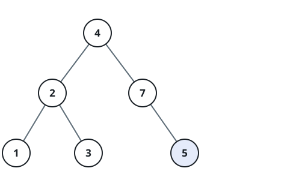
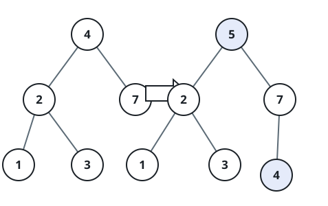

# Graft a Leaf into a Search Tree

## Description

You are given the `root` of a binary search tree (BST) and a value that is
guaranteed not to already appear anywhere in it. Attach the value to the
tree as a new node and return the root of the resulting BST.

Because the value is absent, running the ordinary BST search for it is
guaranteed to walk off the tree through exactly one empty child slot:
descend right whenever the value exceeds the current node and left
otherwise, and graft a fresh leaf into the first empty slot the descent
reaches. If the tree starts out empty, the new node simply becomes the
root. Every other node keeps the children it already had — nothing is
rotated or rebalanced — so the final shape is fully determined by the
starting tree and the value being grafted in.

### Example 1



```text
Input: root = [4,2,7,1,3], val = 5
Output: [4,2,7,1,3,5]
```



### Example 2

```text
Input: root = [8,3,10,1,6,null,14], val = 5
Output: [8,3,10,1,6,null,14,null,null,5]
```

### Example 3

```text
Input: root = [], val = 9
Output: [9]
Explanation: Grafting into an empty tree makes the new node the root.
```

### Constraints

- The tree holds between `0` and `10⁴` nodes.
- `-10⁸ <= Node.val <= 10⁸`, and every existing node value is distinct.
- `-10⁸ <= val <= 10⁸`.
- `val` is guaranteed not to already exist in the tree.
