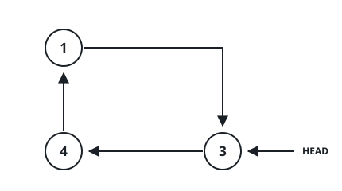
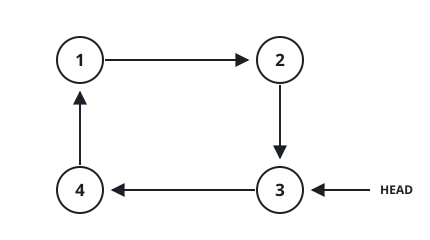

# Threading a Value into a Sorted Ring

## Description

You are handed one node of a circular linked list whose values sit in
non-descending order around the ring, plus a value `insertVal` to add.
Weave a new node carrying `insertVal` into the ring so the ring stays
sorted, and return a working reference to the (now larger) ring. The
node you are handed is not guaranteed to hold the ring's smallest value
— it can be any node on the ring.

Several positions may all keep the ring sorted (for example, when
`insertVal` repeats an existing value); inserting at any one of them is
accepted.

If the ring is empty — the given node is null — build a single node
that links to itself and return that node. Otherwise, return the same
node you were originally given.

### Example 1



```text
Input: head = [3,4,1], insertVal = 2
Output: [3,4,1,2]
Explanation: In the figure above, there is a sorted circular list of three elements. You are given a reference to the node with value 3, and we need to insert 2 into the list. The new node should be inserted between node 1 and node 3. After the insertion, the list should look like this, and we should still return node 3.
```



### Example 2

```text
Input: head = [], insertVal = -7
Output: [-7]
Explanation: The ring is empty (the given node is null), so a fresh
node links to itself and becomes the answer.
```

### Example 3

```text
Input: head = [7,9,5], insertVal = 3
Output: [7,9,3,5]
Explanation: The ring's values are 5, 7, 9 in sorted order, but the
node you are handed holds 7 — not the smallest. 3 is below every value
on the ring, so it belongs right before the wrap from the largest value
(9) back to the smallest (5). The returned reference still starts the
walk at 7, the node originally given.
```

### Constraints

- The ring holds between `0` and `5 * 10⁴` nodes.
- `-10⁶ <= Node.val, insertVal <= 10⁶`.
