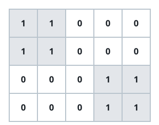

# Unique Island Shapes II

## Description

You are given an `m x n` binary matrix `grid`, where each `1` is land and
each `0` is water. An island is a maximal group of land cells connected
4-directionally (up, down, left, right); every cell on the grid's border
touches water on the outside, so no island wraps around an edge.

Two islands count as the same shape if one can be turned into the other
by some combination of rotating it by 90, 180, or 270 degrees and
reflecting it (flipping left-right or up-down) — eight orientations in
total, including the shape unchanged.

Return how many shapes are distinct once all such rotations and
reflections are treated as identical.

### Example 1



```text
Input: grid = [[1,1,0,0,0],[1,0,0,0,0],[0,0,0,0,1],[0,0,0,1,1]]
Output: 1
Explanation: The two islands are considered the same because if we make a 180
degrees clockwise rotation on the first island, then two islands will have the
same shapes.
```

### Example 2


```text
Input: grid = [[1,1,0,0,0],[1,1,0,0,0],[0,0,0,1,1],[0,0,0,1,1]]
Output: 1
```

### Constraints

- `m == grid.length` and `n == grid[i].length`.
- `1 <= m, n <= 50`.
- Every cell of `grid` is `0` or `1`.
