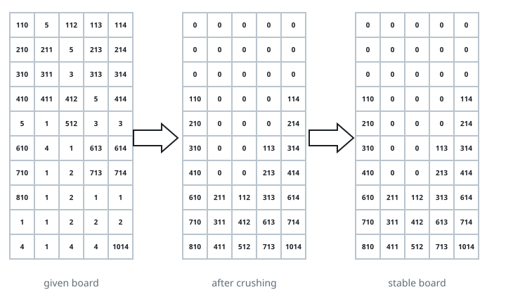

# Sugar Cascade

## Description

You're modeling a single settle-down step of a match-three candy game.
You're given an `m x n` grid `board` of candy identifiers, where
`board[i][j]` is the type of the candy occupying that cell, and `0` marks
a cell that is already empty.

The grid you receive is a snapshot taken right after the player's move,
so it may still contain runs that should clear. Bring the grid to rest by
repeating this two-step cycle:

- **Clear:** find every candy that belongs to a run of three or more
  equal, nonzero values in a row (three or more consecutive cells sharing
  a value, read horizontally) or a column (read vertically). All such
  candies clear at the same instant, turning their cells to `0`. A candy
  that belongs to both a horizontal run and a vertical run still clears
  only once, in this same pass.
- **Settle:** once clearing is done, every remaining candy falls straight
  down within its own column until it rests on another candy or on the
  floor of the grid. Cells that stay empty after settling are at the top
  of their column; nothing enters the grid from outside.

Clearing can expose new runs of three, so repeat the clear-then-settle
cycle until a pass clears nothing. Return the grid at that point.

### Example 1



```text
Input: board = [[110,5,112,113,114],[210,211,5,213,214],[310,311,3,313,314],[410,411,412,5,414],[5,1,512,3,3],[610,4,1,613,614],[710,1,2,713,714],[810,1,2,1,1],[1,1,2,2,2],[4,1,4,4,1014]]
Output: [[0,0,0,0,0],[0,0,0,0,0],[0,0,0,0,0],[110,0,0,0,114],[210,0,0,0,214],[310,0,0,113,314],[410,0,0,213,414],[610,211,112,313,614],[710,311,412,613,714],[810,411,512,713,1014]]
```

The bottom-left block of `1`s and `2`s clears first (three-in-a-row and
three-in-a-column runs overlap there), along with the pair of `5`s in
column 2 combined with the `3`s beneath them. Once those cells empty out,
every surviving candy in each column drops down to fill the gap, and no
further runs appear — the grid shown is already stable.

### Example 2

```text
Input: board = [[1,1,1,2,2],[3,4,5,6,7],[3,4,5,6,7],[3,4,5,6,7],[8,9,10,11,12]]
Output: [[0,0,0,0,0],[0,0,0,0,0],[0,0,0,0,0],[0,0,0,2,2],[8,9,10,11,12]]
```

Row 0's three `1`s clear immediately, and every one of columns 0–4 also
holds a three-in-a-column run (`3,3,3`, `4,4,4`, `5,5,5`, `6,6,6`,
`7,7,7`) that clears in the same pass. After settling, only the leftover
`2,2` pair from row 0 (never part of a run) and the bottom row remain,
and neither forms a new run, so the grid is stable.

### Constraints

- `m == board.length`
- `n == board[i].length`
- `3 <= m, n <= 50`
- `1 <= board[i][j] <= 2000`

## Hints

### Hint 1

Handle "clear" and "settle" as two clearly separated passes over the
whole grid. In the clear pass, mark every cell that should vanish without
mutating the grid mid-scan, then zero out all marked cells together. In
the settle pass, compact each column independently — for example by
copying its nonzero values toward the bottom and zeroing the rest.
Alternate the two passes until a clear pass marks nothing.
