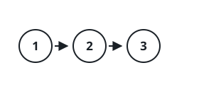
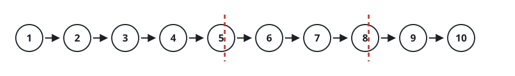

# Linked List Segmentation

## Description

You're given the `head` of a singly linked list and an integer `k`. Cut
the list into `k` consecutive segments and return them.

Distribute the nodes as evenly as possible: across the `k` segments, no
two segment lengths may differ by more than one. When `k` exceeds the
number of nodes, the extra trailing segments come back empty.

Segments must appear in the same order the nodes occurred in the input,
and no earlier segment may be shorter than a later one — any surplus
length is front-loaded onto the earliest segments.

Return an array of the `k` segments, each written as the sequence of its
node values, with an empty segment written as `[]`.

### Example 1



```text
Input: head = [1,2,3], k = 5
Output: [[1],[2],[3],[],[]]
Explanation: The three nodes fill the first three parts; the last two parts
are empty.
```

Only three nodes exist for five segments, so segments 4 and 5 come back
empty while each of the first three carries exactly one node.

### Example 2



```text
Input: head = [1,2,3,4,5,6,7,8,9,10], k = 3
Output: [[1,2,3,4],[5,6,7],[8,9,10]]
Explanation: The input has been split into consecutive parts with size
difference at most 1, and earlier parts are a larger size than the later
parts.
```

Ten nodes over three segments gives a base length of 3 with one node left
over; that extra node goes to the first segment, producing sizes 4, 3, 3.

### Constraints

- The number of nodes in the list is in the range `[0, 1000]`.
- `0 <= Node.val <= 1000`
- `1 <= k <= 50`

## Hints

### Hint 1

With `N` total nodes split across `k` segments, every segment holds
`N / k` nodes, except the first `N % k` segments, which each hold one
extra.
