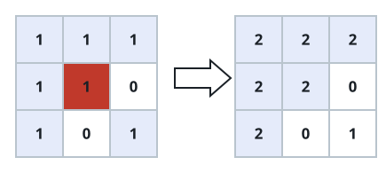

# Paint Bucket Fill

## Description

You have an `m x n` grid of integers `image`, where `image[row][col]` is the
color of the pixel at that position. You are also given a starting pixel
`(sr, sc)` and a new `color`. Simulate clicking a paint-bucket tool at the
starting pixel:

- Note the color currently sitting at `image[sr][sc]` — call it the
  _target_ color — and repaint that pixel with `color`.
- From there, spread outward: any pixel that touches an already-repainted
  pixel on one of its four sides (up, down, left, right) and still carries
  the target color also gets repainted with `color`.
- Keep spreading through newly repainted pixels until no neighboring pixel
  of the target color remains.

Only pixels reachable this way — connected to the start through a chain of
side-adjacent target-colored pixels — are ever touched; pixels of the same
value sitting elsewhere in the grid, with no such connecting path, are left
alone.

Return the grid after the fill finishes.

### Example 1

```text
Input: image = [[1,1,1],[1,1,0],[1,0,1]], sr = 1, sc = 1, color = 2
Output: [[2,2,2],[2,2,0],[2,0,1]]
Explanation: Starting at (1, 1), every pixel reachable through a chain of
side-adjacent 1s gets repainted to 2. The 1 in the bottom-right corner has
no such chain to the start — it only touches 2s and a 0 — so it keeps its
original color.
```



### Example 2

```text
Input: image = [[5,5],[5,5]], sr = 0, sc = 1, color = 5
Output: [[5,5],[5,5]]
Explanation: The pixel at (0, 1) is already color 5, the same as the
requested fill color, so the grid is returned unchanged.
```

### Constraints

- `m == image.length`
- `n == image[i].length`
- `1 <= m, n <= 50`
- `0 <= image[i][j], color < 2¹⁶`
- `0 <= sr < m`
- `0 <= sc < n`

## Hints

### Hint 1

Repaint the starting pixel, then visit each of its four neighbors: any that
still carries the pixel's original color gets repainted and visited in
turn. The fill keeps spreading outward from every pixel it just touched
until it runs out of matching neighbors.
