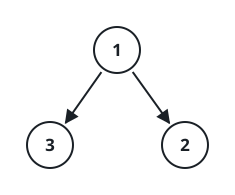
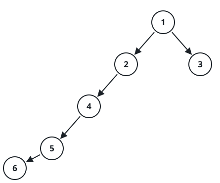

# Nearest Leaf to a Target Node

## Description

You are given the `root` of a binary tree whose node values are all
distinct, along with an integer `k` that is guaranteed to equal some
node's value. Find the value of the leaf node closest to that node.

Closeness is counted in tree edges, and the path between two nodes may
travel in either direction — climbing up through a parent as well as
descending through a child. A node with no children is a leaf. If more
than one leaf ties for the shortest distance, report the smallest value
among them.

### Example 1



```text
Input: root = [1,3,2], k = 1
Output: 2
Explanation: Both children of node 1 — the leaves 3 and 2 — sit exactly
one edge away; 2 is smaller, so it wins the tie.
```

### Example 2


```text
Input: root = [1], k = 1
Output: 1
Explanation: A single-node tree has no children, so the target node is
already a leaf, at distance zero from itself.
```

### Example 3



```text
Input: root = [1,2,3,4,null,null,null,5,null,6], k = 2
Output: 3
Explanation: Climbing from node 2 up to the root and over to leaf 3 costs
two edges; descending from node 2 down to leaf 6 costs three edges. The
shorter path wins, so 3 is the answer.
```

### Constraints

- The number of nodes in the tree is in the range `[1, 1000]`.
- `1 <= Node.val <= 1000`
- All the values in the tree are unique.
- There exists some node in the tree where `Node.val == k`.

## Hints

### Hint 1

Treat the tree as an undirected graph and expand outward from the target
node level by level. Equivalently, for every node along the path from the
root down to the target, work out how close its own nearest leaf is.
