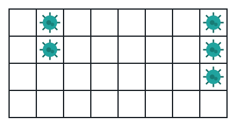
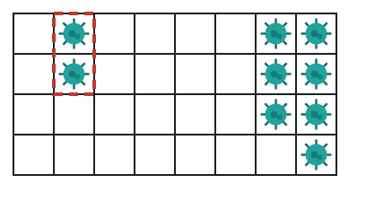
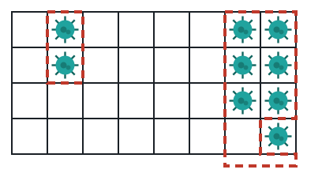
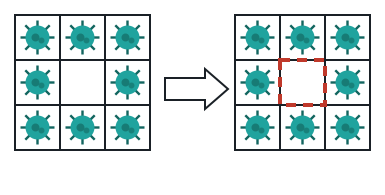

# Quarantine the Outbreak

## Description

An outbreak is loose on a grid, and each day you get to erect a wall
around exactly one infected zone before nightfall.

The grid `isInfected` has `m` rows and `n` columns; `isInfected[i][j] == 1`
marks an infected cell and `0` marks a clean one. A wall can be placed on
the shared edge between any two cells that are 4-directionally adjacent,
sealing that edge for good.

Each infected zone is a maximal group of infected cells connected
horizontally or vertically. Every day, look at how many distinct clean
cells each zone would reach if it spread outward by one step that night,
and wall in the single zone with the largest such reach — one wall per
edge it shares with a clean cell. Then night falls: every zone you did NOT
wall in spreads into every clean cell adjacent to it. Repeat this day/night
cycle until no remaining zone can reach a clean cell — either because
every zone is walled off or because the whole grid is infected.

Return the total number of walls built across all days. The input is
guaranteed never to produce a tie for "largest reach" on any given day.

### Example 1







```text
Input: isInfected = [[0,1,0,0,0,0,0,1],[0,1,0,0,0,0,0,1],[0,0,0,0,0,0,0,1],[0,0,0,0,0,0,0,0]]
Output: 10
Explanation: Two zones exist from the start, and neither ever reaches the other. Day one walls in the left zone (5 walls); day two walls in the right zone (5 walls). Total: 10.
```

### Example 2



```text
Input: isInfected = [[1,1,1],[1,0,1],[1,1,1]]
Output: 4
Explanation: The ring of eight infected cells surrounds a single clean cell. Only one wall is needed per shared edge, and the clean cell has exactly four infected neighbors, so 4 walls seal it off — even though just one cell was ever at risk.
```

### Example 3

```text
Input: isInfected = [[1,1,1,0,0],[1,1,1,0,0],[0,0,0,0,0],[0,0,0,0,1],[0,0,0,0,0]]
Output: 11
Explanation: Day one: the 2x3 block threatens 5 clean cells versus 3 for the lone infected cell, so it is walled in for 5 walls, while the lone cell spreads into its 3 neighbors overnight. Day two: that now plus-shaped zone threatens 4 clean cells and is walled in for 6 more walls, leaving nothing left to spread. Total: 5 + 6 = 11.
```

### Constraints

- `m == isInfected.length`
- `n == isInfected[i].length`
- `1 <= m, n <= 50`
- `isInfected[i][j]` is either `0` or `1`.
- The zone with the largest reach on any given day is always unique — the
  input never forces a tiebreak.

## Hints

### Hint 1

Simulate day by day: relabel every infected zone from scratch each
morning (merges from the previous night can join zones together), and
while walking each zone track both its wall count (one per shared edge
with a clean cell) and the set of distinct clean cells it borders.

### Hint 2

Wall in whichever zone borders the most distinct clean cells, add its wall
count to the running total, then mark those cells inert so they never
spread or get relabeled again. Every other zone then spreads into all of
its bordered clean cells at once — a cell bordered by several spreading
zones only gets infected once, and cells the walled-in zone bordered stay
exposed to any other zone still reaching them.
