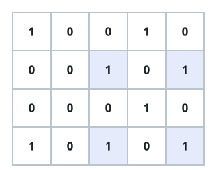
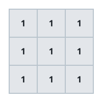
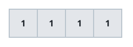

# Rectangle Corner Tally

## Description

You are given an `m x n` binary matrix `grid`. Count how many
axis-aligned rectangles have all four of their corners sitting on cells
that equal `1`.

Formally, count the quadruples of distinct grid positions
`(r1, c1), (r1, c2), (r2, c1), (r2, c2)` — with `r1 != r2` and
`c1 != c2` — where all four positions hold a `1`. Nothing about the
cells strictly between the four corners matters: whatever values sit
along the edges or inside the rectangle's interior, whether `0` or `1`,
has no bearing on whether the corners count.

### Example 1



```text
Input: grid = [[1,0,0,1,0],[0,0,1,0,1],[0,0,0,1,0],[1,0,1,0,1]]
Output: 1
Explanation: There is only one corner rectangle, with corners grid[1][2],
grid[1][4], grid[3][2], and grid[3][4].
```

### Example 2



```text
Input: grid = [[1,1,1],[1,1,1],[1,1,1]]
Output: 9
Explanation: There are four 2x2 rectangles, four 2x3 and 3x2 rectangles,
and one 3x3 rectangle.
```

### Example 3



```text
Input: grid = [[1,1,1,1]]
Output: 0
Explanation: A single row can never supply two distinct row indices, so
no rectangle can be formed no matter how many 1's it holds.
```

### Constraints

- `m == grid.length`
- `n == grid[i].length`
- `1 <= m, n <= 200`
- `grid[i][j]` is either `0` or `1`.
- The number of `1`'s in the grid is in the range `[1, 6000]`.

## Hints

### Hint 1

A rectangle is really a choice of two rows and two columns where all
four crossings hold a `1`. Fix the two columns first: any two rows that
both have `1`'s in those same two columns complete a rectangle together.

### Hint 2

Walk the rows top to bottom. In the current row, every pair of columns
that both hold a `1` matches some number of earlier rows that showed the
same column pair — each of those earlier rows closes one new rectangle
with the current row. Track how many times each column pair has been
seen so far and accumulate as you go.
