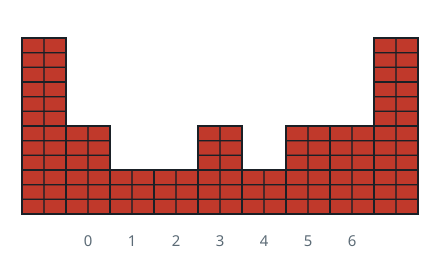
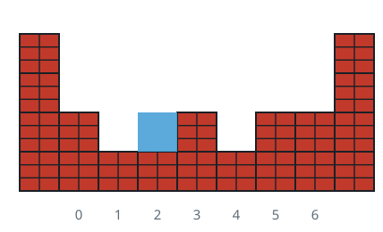
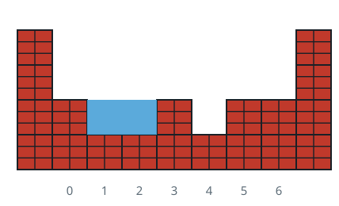
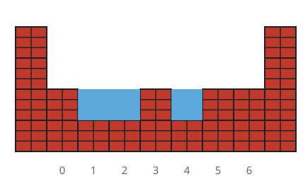
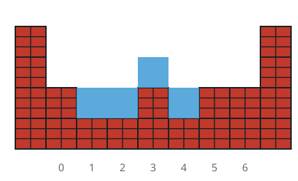

# Droplet Landing

## Description

You are given an elevation profile `heights`, one unit wide at every
index, and told to drop `volume` unit-sized droplets, one at a time, at
column index `k`.

Each droplet lands at column `k` and then settles by this rule, checked
freshly for every droplet: a droplet can slide sideways only onto a
column whose current level (terrain plus whatever water already sits
there) is no higher than where it stands. Trace how far it could slide
left this way — if that slide would ever put it strictly lower than
where it started, it commits to sliding left, as far as it can go while
staying on that lowest reachable level. Otherwise, try the same check to
the right. If neither side ever gets it lower, the droplet simply adds
one unit of height at column `k` itself. Treat the terrain outside both
array ends as infinitely tall, so droplets never slide off the edges.

After all `volume` droplets have settled, return the array where each
entry is the final level at that column — terrain height plus any water
resting on it.

### Example 1











```text
Input: heights = [2,1,1,2,1,2,2], volume = 4, k = 3
Output: [2,2,2,3,2,2,2]
Explanation: Droplet 1 lands at index 3 (level 2). Sliding left ever gets it
lower, so it commits left and stops at index 2, the farthest point on that
lowest reachable level. Droplet 2 checks left first too — left still gets
it lower, so it slides left again, past index 2 (now equal in height) and
settles at index 1. Droplet 3 finds left can no longer get it lower, so it
tries right instead, which does get it lower, and settles at index 4.
Droplet 4 finds neither side ever gets it lower, so it just adds height at
index 3.
```

### Example 2

```text
Input: heights = [3,2,1,2,3], volume = 3, k = 2
Output: [3,3,3,2,3]
Explanation: The valley at index 2 sits evenly between two walls of equal
height. Droplets 1 and 2 can't get lower sliding either way, so each just
raises index 2 in place (1 -> 2 -> 3). Now index 2 finally outranks its
left neighbor, so droplet 3 slides left and settles at index 1.
```

### Example 3

```text
Input: heights = [4,1,4], volume = 6, k = 1
Output: [5,5,5]
Explanation: Index 1 is a single-column well between two equal walls, so
droplets 1 through 4 stack straight up in place, from level 1 to level 5.
Once the pool tops the left wall, droplet 5 slides left and settles at
index 0; droplet 6 then tops the right wall and settles at index 2,
leveling the whole span at 5.
```

### Constraints

- `1 <= heights.length <= 100`
- `0 <= heights[i] <= 99`
- `0 <= volume <= 2000`
- `0 <= k < heights.length`
