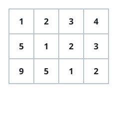
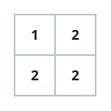

# Constant Diagonal Grid

## Description

You are given an `m x n` matrix. Determine whether every top-left-to-
bottom-right diagonal of the matrix holds a single repeated value — that is,
for every diagonal, all of the cells lying on it are equal to one another.
Return `true` if this holds for every diagonal, and `false` if any diagonal
contains two different values.

### Example 1



```text
Input: matrix = [[1,2,3,4],[5,1,2,3],[9,5,1,2]]
Output: true
Explanation: The diagonals are "[9]", "[5, 5]", "[1, 1, 1]", "[2, 2, 2]",
"[3, 3]", "[4]". Every diagonal is a run of one repeated value, so the grid
qualifies.
```

### Example 2



```text
Input: matrix = [[1,2],[2,2]]
Output: false
Explanation: The diagonal "[1, 2]" mixes two different values, so the grid
does not qualify.
```

### Constraints

- `m == matrix.length`
- `n == matrix[i].length`
- `1 <= m, n <= 20`
- `0 <= matrix[i][j] <= 99`

### Follow-up

Suppose the matrix lives on disk and you can only hold one row in memory at
a time — how would you check the property under that limit?

Suppose further that even a single row doesn't fit in memory and you can
only hold a partial row at a time — how would you adapt?

## Hints

### Hint 1

Every cell (other than those in the first row or first column) sits on the
same diagonal as the cell one step up and to its left. So the whole matrix
qualifies exactly when every cell equals that top-left neighbor — no
diagonal bookkeeping is needed at all.
