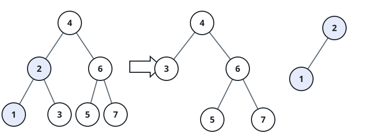

# BST Threshold Partition

## Description

You are given the `root` of a binary search tree (BST) and an integer
`target`. Break the tree into two subtrees: one containing every node
whose value is at most `target`, the other containing every node whose
value exceeds `target`. `target` doesn't need to match any node's value.

The split must preserve as much of the original shape as possible: for
any child `c` and its parent `p` in the original tree, if the split
places both `c` and `p` in the same subtree, `c` must still hang directly
under `p` there.

Return an array holding the two resulting roots, in order — the subtree
of values at most `target` first, then the subtree of greater values. An
empty subtree is represented as `[]`.

### Example 1



```text
Input: root = [4,2,6,1,3,5,7], target = 2
Output: [[2,1],[4,3,6,null,null,5,7]]
Explanation: Values 1 and 2 don't exceed the target, so they form the
first subtree; the remaining values keep their original shape in the
second subtree, with node 3 sliding into the spot node 2 vacated under 4.
```

### Example 2

```text
Input: root = [2,1], target = 2
Output: [[2,1],[]]
Explanation: Both nodes have values at most the target, so the whole
tree becomes the first subtree and the second one is empty.
```

### Constraints

- The number of nodes in the tree is in the range `[1, 50]`.
- `0 <= Node.val, target <= 1000`

## Hints

### Hint 1

Recurse: when `root.val <= target`, split `root.right` in two and
re-attach its lower half onto `root.right` before returning `root` as
part of the first subtree — and mirror this on the other side otherwise.
