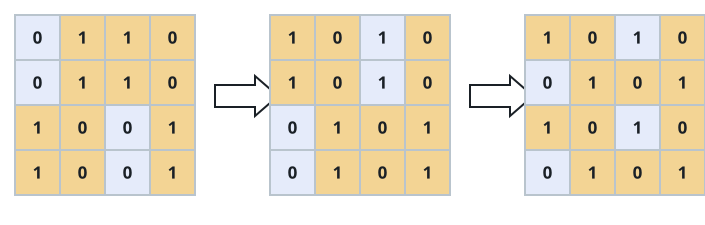
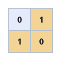
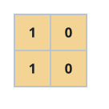

# Checkerboard Reseating

## Description

You are given an `n x n` binary grid `board`. A move swaps two entire rows,
or swaps two entire columns.

A checkerboard arrangement is one where every `0` and every `1` has only
opposite-value neighbors in the four cardinal directions — no two equal
values ever touch edge-to-edge.

Return the fewest moves needed to rearrange `board` into a checkerboard
arrangement, or `-1` if no sequence of row and column swaps can ever reach
one.

### Example 1



```text
Input: board = [[0,1,1,0],[0,1,1,0],[1,0,0,1],[1,0,0,1]]
Output: 2
Explanation: Swapping the first and second columns, then the second and
third rows, produces a checkerboard.
```

### Example 2



```text
Input: board = [[0,1],[1,0]]
Output: 0
Explanation: The board already alternates in both directions; note that
starting with 1 in the top-left corner would also count as valid.
```

### Example 3



```text
Input: board = [[1,0],[1,0]]
Output: -1
Explanation: Both rows are identical, and swapping rows or columns can
never make identical rows differ, so no checkerboard is reachable.
```

### Constraints

- `n == board.length`
- `n == board[i].length`
- `2 <= n <= 30`
- `board[i][j]` is either `0` or `1`.
