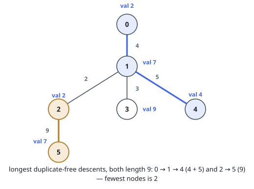
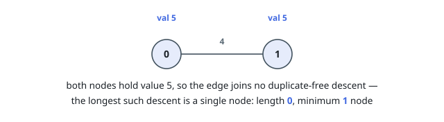

# Longest Duplicate-Free Descent

## Description

You are given an undirected tree rooted at node `0`, with `n` nodes numbered
`0` to `n - 1`. Its `n - 1` edges are listed in `edges`, where
`edges[i] = [ui, vi, lengthi]` joins `ui` and `vi` with an edge of length
`lengthi`. The array `nums` gives the value sitting at each node: `nums[i]`
is the value at node `i`.

A _descent_ is a path that starts at some node and follows edges downward to
one of its descendants; it may consist of a single node. A descent is
_duplicate-free_ when no value appears at two of its nodes.

Among all duplicate-free descents, let `L` be the greatest total edge length.
Return `[L, m]`, where `m` is the fewest nodes any duplicate-free descent of
length `L` can have.

### Example 1

```text
Input: edges = [[0,1,4],[1,2,2],[1,3,3],[1,4,5],[2,5,9]], nums = [2,7,2,9,4,7]
Output: [9,2]
Explanation: Two descents reach total length 9. The first, 0 -> 1 -> 4, has
values 2, 7, 4 and spans three nodes; the second, 2 -> 5, has values 2, 7 and
spans two. Descents that would run through node 3 are shorter, and any
descent containing both 1 and 5 repeats the value 7.
```



### Example 2

```text
Input: edges = [[1,0,4]], nums = [5,5]
Output: [0,1]
Explanation: Both nodes hold value 5, so the edge belongs to no duplicate-free
descent. A single node is the best available: length 0, one node.
```



### Constraints

- `2 <= n <= 5 * 10⁴`
- `edges.length == n - 1`
- `edges[i].length == 3`
- `0 <= ui, vi < n`
- `1 <= lengthi <= 10³`
- `nums.length == n`
- `0 <= nums[i] <= 5 * 10⁴`
- `edges` describes a valid tree.

## Hints

### Hint 1

Every candidate lives on some root-to-node route, so one depth-first walk
that always knows the distance from the root to the current node sees them
all.

### Hint 2

A descent ending at the current node is a trailing piece of that route, and
its length is a difference of two prefix distances — provided you know the
shallowest point it may start from.

### Hint 3

Keep, per value, the depth of its latest occurrence on the current route. A
repeat forces the start deeper, exactly like the left edge of a sliding
window; remember to undo the state when the walk backtracks.
