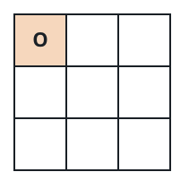
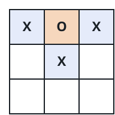
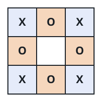

# Reachable Grid State

## Description

You are given a `3 x 3` grid `board` describing a snapshot of a
tic-tac-toe game, where each cell is `'X'`, `'O'`, or `' '` (still
empty). Determine whether this exact snapshot could ever occur partway
through — or at the end of — a game played by the standard rules.

The standard rules constrain which snapshots are reachable:

- Turns strictly alternate, and `'X'` always moves first.
- A move only fills a currently empty cell; no cell changes once
  written.
- The moment any row, column, or diagonal is filled with three of the
  same mark, the game is decided and stops immediately.
- Play also stops once every cell is filled, even without three in a
  row.
- No move is ever made after the game has already stopped.

Return `true` if some legal sequence of moves produces `board`, and
`false` otherwise.

### Example 1



```text
Input: board = ["O  ","   ","   "]
Output: false
Explanation: A single mark is on the board, but the opening move of any
game must be an "X", not an "O".
```

### Example 2



```text
Input: board = ["XOX"," X ","   "]
Output: false
Explanation: The board holds three "X" marks and only one "O", but
turns must alternate strictly — after three "X" moves, exactly two "O"
moves must have been played in between.
```

### Example 3



```text
Input: board = ["XOX","O O","XOX"]
Output: true
```

### Constraints

- `board.length == 3`
- `board[i].length == 3`
- `board[i][j]` is either `'X'`, `'O'`, or `' '`.
