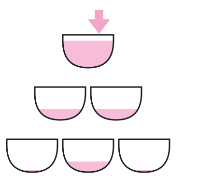

# Cascading Pour Tower

## Description

A stack of glasses is arranged in a triangular tower: row `0` holds 1
glass, row `1` holds 2 glasses, and so on down to row 99, each glass
holding exactly one cup's worth of liquid.

Liquid is poured only into the single glass at the top of the tower.
Once a glass is completely full, any additional liquid it receives
overflows and splits evenly onto the two glasses directly beneath it —
one to the lower-left, one to the lower-right — which then overflow the
same way onto the row below them, and so on down the tower. (A glass on
the bottom row simply spills its overflow away; nothing catches it.)

To see the cascade concretely: pouring 1 cup leaves the top glass
exactly full with nothing to spare. Pouring 2 cups fills the top glass
and sends its 1 cup of overflow split evenly onto the two second-row
glasses, so each ends up half full. Pouring 3 cups is enough overflow to
fill both second-row glasses completely. Pouring 4 cups pushes overflow
one row further: the middle glass of the third row ends up half full,
while the two outer glasses of that row each end up a quarter full.



Given the total amount poured, report how full the glass at row `i`,
position `j` ends up (both 0-indexed), as a fraction between `0` and `1`.

### Example 1

```text
Input: poured = 1, query_row = 2, query_glass = 0
Output: 0.00000
Explanation: Pouring exactly 1 cup fills only the top glass with nothing
left over, so no liquid ever reaches row 2 — the queried glass stays
empty.
```

### Example 2

```text
Input: poured = 4, query_row = 2, query_glass = 1
Output: 0.50000
Explanation: The overflow from pouring 4 cups reaches the third row, and
the walkthrough above shows its middle glass — row 2, position 1 — lands
at half full.
```

### Example 3

```text
Input: poured = 100000009, query_row = 50, query_glass = 25
Output: 1.00000
```

### Constraints

- `0 <= poured <= 10⁹`
- `0 <= query_glass <= query_row < 100`
