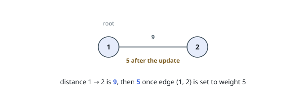
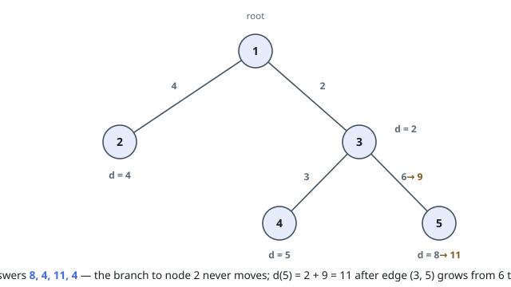
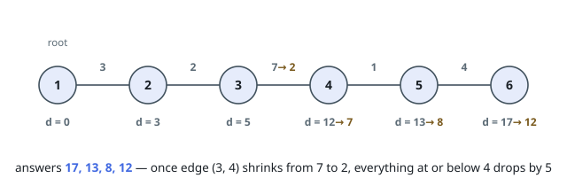

# Root Distances Under Edge Updates

## Description

You are given an integer `n` and a weighted tree rooted at node `1`, whose
nodes are numbered `1` to `n`. The tree arrives as a 2D array `edges` of
length `n - 1`, where `edges[i] = [u, v, w]` joins `u` and `v` with an edge of
weight `w`.

You are also given a 2D array `queries`. Each entry is one of:

- `[1, u, v, w']` — replace the weight of the edge joining `u` and `v` with
  `w'`; that edge is guaranteed to be one of the given `edges`.
- `[2, x]` — ask for the distance from the root, node `1`, to node `x`.

Collect one output per asking query, in order: return the array `answer`
holding those distances.

### Example 1

```text
Input: n = 2, edges = [[1,2,9]], queries = [[2,2],[1,1,2,5],[2,2]]
Output: [9,5]
Explanation: The only path from the root to node 2 is the single edge, first
at weight 9. After it is rewritten to 5, the same question yields 5.
```



### Example 2

```text
Input: n = 5, edges = [[1,2,4],[1,3,2],[3,5,6],[3,4,3]], queries = [[2,5],[2,2],[1,3,5,9],[2,5],[2,2]]
Output: [8,4,11,4]
Explanation: The path to node 5 runs 1 - 3 - 5 and costs 2 + 6 = 8, while node
2 sits on its own branch at cost 4. Rewriting edge (3,5) from 6 to 9 lifts the
distance to node 5 to 2 + 9 = 11 and leaves node 2 untouched at 4.
```



### Example 3

```text
Input: n = 6, edges = [[1,2,3],[2,3,2],[3,4,7],[4,5,1],[5,6,4]], queries = [[2,6],[2,5],[1,3,4,2],[2,5],[2,6]]
Output: [17,13,8,12]
Explanation: Along the chain, the root reaches node 5 for 3 + 2 + 7 + 1 = 13
and node 6 for 17. Cutting edge (3,4) down from 7 to 2 shortens everything at
or below node 4 by 5: node 5 drops to 8 and node 6 to 12.
```



### Constraints

- `1 <= n <= 10^5`
- `edges.length == n - 1`
- `edges[i] == [u, v, w]`
- `1 <= u, v <= n`
- `1 <= w <= 10^4`
- `edges` describes a valid tree
- `1 <= queries.length <= 10^5`
- each query has length 2 or 4, as shown above
- `1 <= u, v, x <= n`, and the pair `(u, v)` in an update is always a given edge
- `1 <= w' <= 10^4`

## Hints

### Hint 1

A tree offers exactly one root-to-node route, so a weight change on one edge
moves the distances of precisely the subtree beneath its deeper endpoint — by
one shared delta.

### Hint 2

Flatten the tree with an Euler tour: each subtree becomes one contiguous index
range, so an update is a range addition and a distance is a point read.

### Hint 3

A Fenwick (binary indexed) tree serves exactly that menu — range add, point
query — in logarithmic time per operation.
