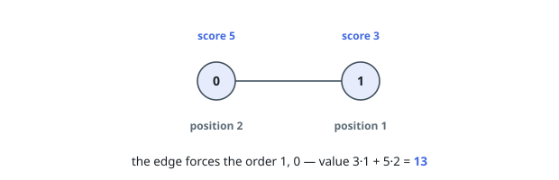
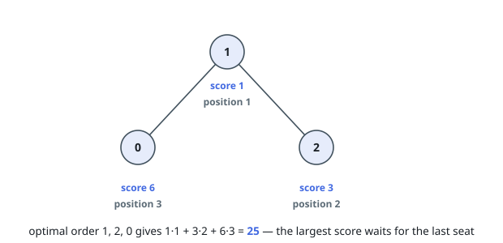

# Maximize Scored Topological Ordering

## Description

You are given a directed acyclic graph on `n` nodes numbered `0` to `n - 1`,
described by a 2D array `edges` where `edges[i] = [u, v]` is a directed edge
from `u` to `v`. Each node carries a score: `score[i]` belongs to node `i`.

List the nodes in an order that respects every edge — `u` ahead of `v`
whenever an edge runs from `u` to `v` — and number the positions of that list
from `1`. The ordering's value is the sum, over nodes, of each node's score
times its position.

Return the largest value any valid ordering can reach.

### Example 1

```text
Input: n = 2, edges = [[1,0]], score = [5,3]
Output: 13
Explanation: The edge forces node 1 in front of node 0, so the positions are
fixed: 3*1 + 5*2 = 13. The larger score cannot escape position 2.
```



### Example 2

```text
Input: n = 3, edges = [[1,0],[1,2]], score = [6,1,3]
Output: 25
Explanation: Node 1 must go first. Either child may follow, and seating node 2
second pays better: 1*1 + 3*2 + 6*3 = 25, against 22 for seating node 0
second. The largest score waits for the last position.
```



### Constraints

- `1 <= n == score.length <= 22`
- `1 <= score[i] <= 10⁵`
- `0 <= edges.length <= n * (n - 1) / 2`
- `edges[i] == [u, v]` denotes a directed edge from `u` to `v`
- `0 <= u, v < n`
- `u != v`
- the graph is a DAG with no duplicate edges

## Hints

### Hint 1

With twenty-two nodes, a set of already-seated nodes fits in one machine word —
enumerate those sets.

### Hint 2

Let the state be the set of nodes occupying the first `k` seats; the value is
the best reachable sum. A node may take seat `k + 1` only once every node with
an edge into it is already seated — precompute each node's predecessors as a
bitmask so the test is one AND.

### Hint 3

Sweep the sets in increasing numeric order (which never decreases the seat
count) so every value is final before it is read, and mark impossible sets so
they cannot leak into successors.
