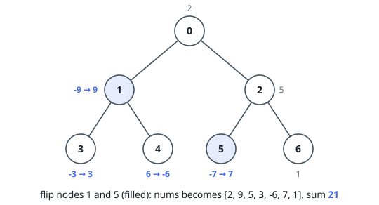
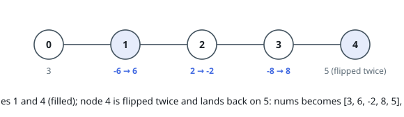

# Subtree Sign-Flip Sum

## Description

You are given a tree with `n` nodes numbered `0` to `n - 1`, rooted at node `0`.
Its `n - 1` edges are listed in the array `edges`, where `edges[i] = [ui, vi]`
joins nodes `ui` and `vi`. Node `i` carries the value `nums[i]`, and you are
also given an integer `k`.

A **sign flip** at node `v` multiplies the value of every node in the subtree
rooted at `v` — `v` and all of its descendants — by `-1`.

Choose a set of nodes to flip, subject to one spacing rule: whenever two
chosen nodes lie on the same root-to-leaf branch (one is an ancestor of the
other), they must be at least `k` edges apart. Chosen nodes in different
branches never restrict each other.

Return the largest sum of node values reachable this way.

### Example 1

```text
Input: edges = [[0,1],[0,2],[1,3],[1,4],[2,5],[2,6]], nums = [2,-9,5,-3,6,-7,1], k = 2
Output: 21
Explanation: Flip nodes 1 and 5. Node 1's flip raises -9 to 9 and -3 to 3 but
drags node 4 down to -6; node 5's flip raises -7 to 7. The final values are
[2, 9, 5, 3, -6, 7, 1], summing to 21.
```



### Example 2

```text
Input: edges = [[0,1],[1,2],[2,3],[3,4]], nums = [3,-6,2,-8,5], k = 2
Output: 20
Explanation: Nodes 1 and 4 are three edges apart, so both may be flipped.
Node 1's flip turns -6 into 6 and -8 into 8 but drags node 4's 5 down to -5;
node 4 then flips itself and lands back on 5. The final values are
[3, 6, -2, 8, 5], summing to 20.
```



### Example 3

```text
Input: edges = [[0,1],[0,2]], nums = [-4,6,-5], k = 3
Output: 7
Explanation: Flip node 2, raising -5 to 5. Flipping node 1 instead would drop
6 to -6, and the root sits only one edge from each leaf, so it cannot join a
leaf flip.
```

### Constraints

- `2 <= n <= 5 * 10⁴`
- `edges.length == n - 1`
- `edges[i] = [ui, vi]`
- `0 <= ui, vi < n`
- `nums.length == n`
- `-5 * 10⁴ <= nums[i] <= 5 * 10⁴`
- `1 <= k <= 50`
- `edges` describes a valid tree.

## Hints

### Hint 1

What determines the final sign of a node's value? Count the flips that reach
it, not the nodes that were flipped.

### Hint 2

A node is touched by its own flip and by every ancestor's flip, so its final
sign is the parity of that count — a subtree computation needs the parity, not
the individual flips.

### Hint 3

The spacing rule only bites along one chain of ancestors. What a subtree
computation must additionally know is the distance up to the nearest flipped
ancestor — and every distance of `k` or more behaves the same.

### Hint 4

Combine the two into a table `dp[u][parity][distance]`, filled bottom-up.
Where the distance has reached `k`, the node may flip itself, switching the
parity it hands down and resetting the distance to 1 below it.
