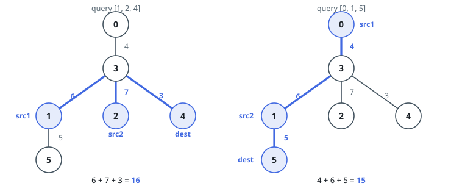
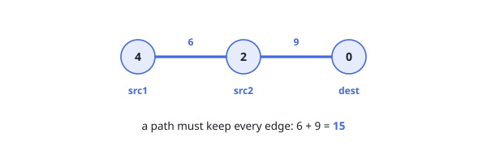

# Least-Weight Subtree Joining Three Nodes

## Description

You are given a tree — a connected undirected graph with no cycles — on `n`
nodes numbered `0` to `n - 1`. Its `n - 1` edges arrive as `edges`, where
`edges[i] = [ui, vi, wi]` says nodes `ui` and `vi` are joined by an edge of
weight `wi`.

You are also given `queries`, where `queries[j] = [aj, bj, tj]` names three
distinct nodes. For each query, pick some subset of the tree's edges that
forms a connected subgraph within which `tj` is reachable from `aj` and from
`bj`, with the smallest possible sum of edge weights.

Return an array holding that smallest total, one entry per query.

### Example 1

```text
Input: edges = [[0,3,4],[3,1,6],[3,2,7],[3,4,3],[1,5,5]], queries = [[1,2,4],[0,1,5]]
Output: [16,15]
Explanation:
answer[0]: joining 1, 2 and 4 takes the three edges touching node 3 — weights
6 + 7 + 3 = 16.
answer[1]: joining 0, 1 and 5 takes the chain 0 - 3 - 1 - 5 — weights
4 + 6 + 5 = 15.
```



### Example 2

```text
Input: edges = [[4,2,6],[2,0,9]], queries = [[4,2,0]]
Output: [15]
Explanation: The whole tree is the path 4 - 2 - 0, and joining the three nodes
needs every edge: 6 + 9 = 15.
```



### Example 3

```text
Input: edges = [[0,1,4],[0,2,6],[0,3,8],[0,4,3]], queries = [[1,2,4]]
Output: [13]
Explanation: Every route between two leaves passes the centre, so joining
1, 2 and 4 keeps exactly the edges to them: 4 + 6 + 3 = 13.
```

### Constraints

- `3 <= n <= 10⁵`
- `edges.length == n - 1`
- `edges[i].length == 3`
- `0 <= ui, vi < n`
- `1 <= wi <= 10⁴`
- `1 <= queries.length <= 10⁵`
- `queries[j].length == 3`
- `0 <= aj, bj, tj < n`
- `aj`, `bj`, `tj` are pairwise distinct.
- `edges` forms a valid tree.

### Follow-up

After `O(n log n)` of preparation, can each query be settled in `O(log n)`?

## Hints

### Hint 1

Root the tree anywhere and record every node's depth and weighted distance
`f(x)` from the root. Two nodes are then `d(x, y) = f(x) + f(y) - 2 * f(w)`
apart, where `w` is their lowest common ancestor — so speed comes down to
finding that ancestor quickly.

### Hint 2

The smallest joining edge set for three nodes is the union of the three paths
between each pair, and each edge of that union lies on exactly two of those
paths. What does that make of `(d(a, b) + d(b, c) + d(c, a)) / 2`?

### Hint 3

Build a binary-lifting ancestor table once, then per query lift the deeper
node to a common depth and hop both upward while their ancestors disagree —
`O(log n)` per ancestor lookup.
