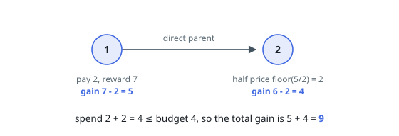
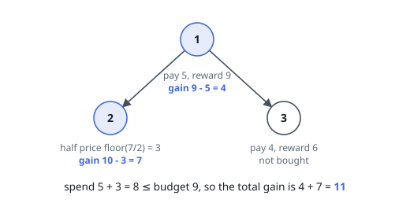
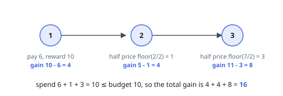

# Best Tree Purchases Within a Budget

## Description

You are given a tree of `n` nodes numbered `1` to `n`, rooted at node `1`. The
array `edges` lists its `n - 1` parent-child pairs, where `edges[i] = [ui, vi]`
means `ui` is the direct parent of `vi`.

Each node `i` offers an item: buying it costs `price[i]` and pays back
`reward[i]`, so purchasing it alone changes your balance by `reward[i] -
price[i]`.

One discount applies: if node `i`'s direct parent has also been bought, node
`i`'s item costs `floor(price[i] / 2)` instead.

Choose a set of nodes to buy so that the total paid stays within `budget`,
and return the largest total of `reward[i] - paid` you can achieve. Rewards do
not enlarge the budget — only the initial `budget` may be spent, each item can
be bought at most once, and buying nothing is allowed (for a total of `0`).

### Example 1

```text
Input: n = 2, price = [2,5], reward = [7,6], edges = [[1,2]], budget = 4
Output: 9
Explanation: Buy both. Node 1 costs 2 and gains 7 - 2 = 5. Node 2's parent
bought, so it costs floor(5 / 2) = 2 and gains 6 - 2 = 4. The total paid is
2 + 2 = 4, exactly the budget, for a gain of 5 + 4 = 9.
```



### Example 2

```text
Input: n = 3, price = [5,7,4], reward = [9,10,6], edges = [[1,2],[1,3]], budget = 9
Output: 11
Explanation: Buy nodes 1 and 2. Node 1 costs 5 and gains 9 - 5 = 4; node 2's
parent bought, so it costs floor(7 / 2) = 3 and gains 10 - 3 = 7. Adding node
3 as well would cost 5 + 3 + 2 = 10, past the budget, so it is skipped and the
total is 4 + 7 = 11.
```



### Example 3

```text
Input: n = 3, price = [6,2,7], reward = [10,5,11], edges = [[1,2],[2,3]], budget = 10
Output: 16
Explanation: Buy all three. Node 1 pays 6, node 2 pays floor(2 / 2) = 1 (its
parent bought), and node 3 pays floor(7 / 2) = 3 (its parent bought). The
total paid is 6 + 1 + 3 = 10, exactly the budget, for gains of
4 + 4 + 8 = 16.
```



### Constraints

- `1 <= n <= 160`
- `price.length, reward.length == n`
- `1 <= price[i], reward[i] <= 50`
- `edges.length == n - 1`
- `edges[i] == [ui, vi]`
- `1 <= ui, vi <= n`
- `ui != vi`
- `1 <= budget <= 160`
- No pair of nodes is joined twice.
- Node `1` is the direct or indirect parent of every other node.
- `edges` contains no cycle.

## Hints

### Hint 1

The price you can get for a node depends on exactly one fact about everything
outside its subtree. Name that fact.

### Hint 2

It is whether the node's direct parent was bought. So the best plan inside a
subtree splits into two budget profiles — one for each answer.

### Hint 3

Each profile is an array indexed by budget already spent. Joining several
children's profiles is an old friend: spend `t` in one child against every
remaining budget level, keep the maximum.

### Hint 4

After every merge and after folding in the node's own purchase, take prefix
maxima so unspent budget never lowers a value.
