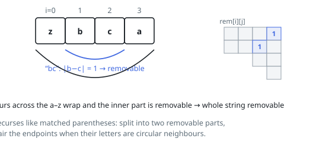

# Solutions — Smallest String After Pair Deletions

## Interval vanishing table plus greedy suffix assembly

Start by asking which substrings can disappear entirely. Let `rem[i][j]` say
whether `s[i..j]` can be wiped out by repeated deletions, and fill it by
increasing length: an interval vanishes if it splits at some `k` into two
independently vanishing parts, or if its two endpoint characters are
neighbours on the circular alphabet (letter distance 1, or 25 for the `'a'`
and `'z'` pair) around an already-vanishing interior — the endpoints pair off
like matched brackets. Length-2 intervals need the endpoint test alone.

The result string is then assembled right to left. `ans[i]`, the smallest
string obtainable from the suffix at `i`, is the minimum over all `j` of
`s[j] + ans[j + 1]`, where the stretch `s[i..j-1]` must vanish (the `j = i`
case keeps `s[i]` and demands nothing); when the entire remaining suffix
vanishes, the empty candidate competes too. Comparing the candidate strings
directly — not merely their leading characters — settles ties correctly,
because each `ans[j + 1]` is already optimal.

Deleting as much as possible is not always right: from `"dabg"`, deleting
`"ab"` leaves `"dg"`, which compares larger than `"dabg"` since `'a' < 'g'`.
That is exactly why every split point is tried instead of deleting greedily.
The comparisons make the second phase cubic in the worst case, which `n ≤ 250`
absorbs; strings of length at most 1 return unchanged.

**Complexity:** `O(n³)` time, `O(n²)` space.
