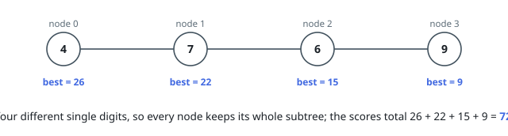
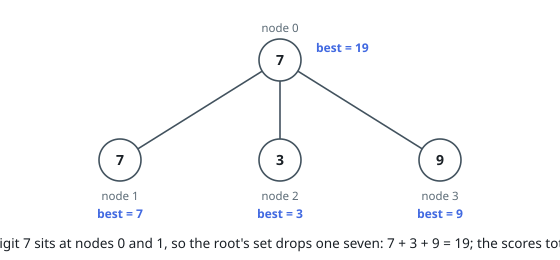

# Digit-Disjoint Subtree Scores

## Description

You are given a tree of `n` nodes numbered `0` to `n - 1`, rooted at node `0`,
described by the parent array `par`: `par[0] == -1` and `par[i]` is the parent
of node `i`. Node `i` holds the value `vals[i]`.

A set of nodes is **digit-disjoint** when the decimal writings of all its
values together use each digit from `0` to `9` at most once. A value that
repeats a digit inside itself, like `33`, can belong to no digit-disjoint set
at all.

For each node `u`, let `best[u]` be the largest sum of values of a
digit-disjoint set chosen from `u`'s subtree — `u` with all its descendants —
where the empty set is allowed and sums to `0`.

Return the sum of `best[u]` over every node, modulo `10⁹ + 7`.

### Example 1

```text
Input: vals = [4,7,6,9], par = [-1,0,1,2]
Output: 72
Explanation: Every value is one digit, and all four digits differ, so each
node's best set is its whole subtree: best = [26,22,15,9], and 26 + 22 + 15 +
9 = 72.
```



### Example 2

```text
Input: vals = [7,7,3,9], par = [-1,0,0,0]
Output: 38
Explanation: Nodes 0 and 1 both hold 7, and no digit-disjoint set may contain
both, so at the root one of them is dropped: best[0] = 7 + 3 + 9 = 19. The
best array is [19,7,3,9], summing to 38.
```



### Example 3

```text
Input: vals = [33,4,7,2], par = [-1,0,1,2]
Output: 37
Explanation: The value 33 writes the digit 3 twice, so node 0 can never be
selected and its subtree falls back to 4 + 7 + 2 = 13. The best array is
[13,13,9,2], summing to 37.
```

### Constraints

- `1 <= n == vals.length <= 500`
- `1 <= vals[i] <= 10⁹`
- `par.length == n`
- `par[0] == -1`
- `0 <= par[i] < n` for `i` in `[1, n - 1]`
- `par` describes a valid tree.

## Hints

### Hint 1

Some values rule themselves out before any choosing happens — which ones?

### Hint 2

For the rest, only the set of digits a value writes matters, and that set is
at most ten bits wide.

### Hint 3

Carry, per node, a table over digit sets: the best sum achievable in the
subtree with exactly that set of digits used. Joining a child means combining
two such tables over disjoint digit sets.

### Hint 4

`best[u]` is the maximum entry of `u`'s finished table; add up these maxima
over all nodes.
