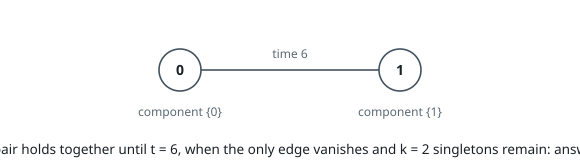
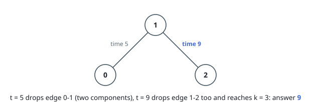
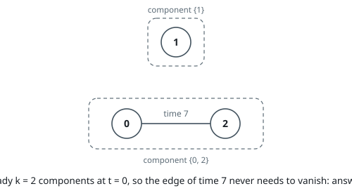

# Earliest Split Into K Components

## Description

You are given a graph with `n` nodes numbered `0` to `n - 1`. Each entry
`edges[i] = [ui, vi, timei]` is an undirected edge between `ui` and `vi` that
vanishes at moment `timei`: while the clock reads `t`, every edge whose time
is `t` or earlier is already gone. You are also given an integer `k`.

Starting from `t = 0`, return the earliest moment at which what remains of the
graph holds at least `k` connected components.

A connected component is a maximal group of nodes joined to each other by
paths of surviving edges, with no surviving edge leaving the group.

### Example 1

```text
Input: n = 2, edges = [[0,1,6]], k = 2
Output: 6
Explanation: The two nodes stay joined through every moment before 6. At
t = 6 the only edge vanishes and the two singletons {0} and {1} remain, which
reaches k = 2.
```



### Example 2

```text
Input: n = 3, edges = [[0,1,5],[1,2,9]], k = 3
Output: 9
Explanation: At t = 5 the edge 0-1 vanishes, leaving {0} and {1, 2} — two
components, one short. At t = 9 the edge 1-2 vanishes too, and the three
singletons {0}, {1}, {2} meet k = 3.
```



### Example 3

```text
Input: n = 3, edges = [[0,2,7]], k = 2
Output: 0
Explanation: Node 1 has no edges at all, so already at t = 0 the graph holds
the two components {1} and {0, 2}. No waiting is needed.
```



### Constraints

- `1 <= n <= 10⁵`
- `0 <= edges.length <= 10⁵`
- `edges[i] = [ui, vi, timei]`
- `0 <= ui, vi < n`
- `ui != vi`
- `1 <= timei <= 10⁹`
- `1 <= k <= n`
- No pair of nodes is joined by two edges.

## Hints

### Hint 1

Edges only disappear as time moves forward, so the component count never
drops. Where, then, can the answer fall — and what is the cheapest set of
moments to inspect?

### Hint 2

Sweep the distinct edge times from largest to smallest, merging surviving
edges into a union-find that starts as `n` singletons.

### Hint 3

Inspect the component count just before each equal-time group merges: that
state is exactly the graph with every edge of that time or less already gone.

### Hint 4

If the count clears `k` before the sweep begins, the graph is split enough at
`t = 0` and the answer is `0`.
