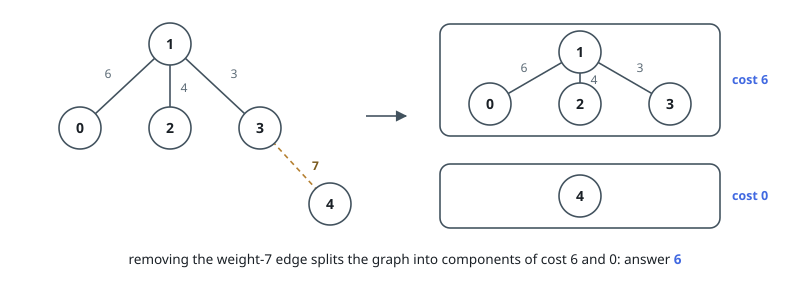
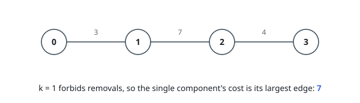

# Lowest Component Cost After Splitting

## Description

You are given a connected undirected graph whose `n` nodes are numbered `0`
to `n - 1`. Its weighted edges are listed as `edges[i] = [ui, vi, wi]`,
joining `ui` and `vi` with weight `wi`. You are also given an integer `k`.

Delete any set of edges you like, on one condition: what remains must break
into at most `k` connected components.

A component's cost is the largest weight among the edges it still contains;
an edgeless component costs `0`. Return the smallest value the most expensive
component's cost can take.

### Example 1

```text
Input: n = 5, edges = [[0,1,6],[1,2,4],[1,3,3],[3,4,7]], k = 2
Output: 6
Explanation: Delete the edge of weight 7 between nodes 3 and 4. The remaining
piece {0,1,2,3} costs max(6, 4, 3) = 6, and the isolated node 4 costs 0, so
the most expensive component costs 6. Keeping that edge would leave a single
component of cost 7, and cutting anything cheaper cannot get below 6, since
the edge of weight 6 would then dangle alone and form a third component.
```



### Example 2

```text
Input: n = 4, edges = [[0,1,3],[1,2,7],[2,3,4]], k = 1
Output: 7
Explanation: At most one component means the graph must stay whole, so every
edge survives and the single component costs its largest weight, 7.
```



### Example 3

```text
Input: n = 3, edges = [[0,1,9],[1,2,8]], k = 3
Output: 0
Explanation: With k = 3 every node may stand alone, so delete both edges:
three edgeless components of cost 0.
```

### Constraints

- `1 <= n <= 5 * 10⁴`
- `0 <= edges.length <= 10⁵`
- `edges[i].length == 3`
- `0 <= ui, vi < n`
- `1 <= wi <= 10⁶`
- `1 <= k <= n`
- The input graph is connected.

## Hints

### Hint 1

Deleting more edges can only add components, never merge them — so what does
an optimal plan look like in terms of a weight threshold?

### Hint 2

For a candidate threshold `t`, keep exactly the edges of weight at most `t`
and count the components with a union-find that starts at `n` singletons.

### Hint 3

The threshold works precisely when that count stays within `k`, and the count
only changes at actual weights — which makes the sorted distinct weights the
only candidates worth testing.

### Hint 4

If `k` is at least `n`, or if keeping no edges at all already fits, the answer
is `0`.
