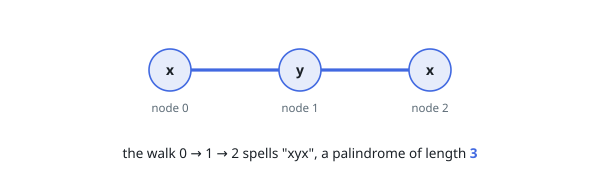
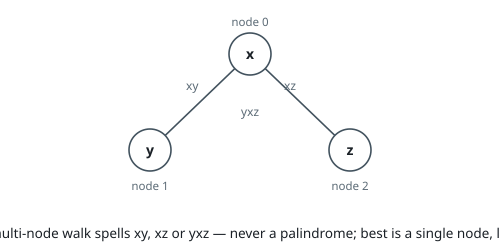
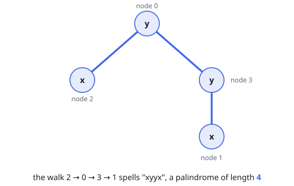

# Longest Path Spelling a Palindrome

## Description

You are given an undirected graph with `n` nodes numbered `0` to `n - 1`,
listed by its edges — `edges[i] = [ui, vi]` joins nodes `ui` and `vi`. Each
node carries a letter: `label[i]` is the letter at node `i`.

A walk starts at any node, repeatedly steps to an adjacent node, and never
returns to a node it has used. Reading the letters along the walk spells a
string. Return the length of the longest walk whose spelling is a palindrome,
reading the same in both directions. A single node always spells a
one-letter palindrome.

### Example 1

```text
Input: n = 3, edges = [[0,1],[1,2]], label = "xyx"
Output: 3
Explanation: Walking 0 → 1 → 2 spells "xyx", which reads the same both ways.
```



### Example 2

```text
Input: n = 3, edges = [[0,1],[0,2]], label = "xyz"
Output: 1
Explanation: The two-edge walks spell "yxz" and nothing shorter than two
letters helps either: "yx" and "xz" are not palindromes. Only a single node
works, for a length of 1.
```



### Example 3

```text
Input: n = 4, edges = [[0,2],[0,3],[3,1]], label = "yxxy"
Output: 4
Explanation: Walking 2 → 0 → 3 → 1 spells "xyyx", using every node exactly
once — the longest possible palindrome here.
```



### Constraints

- `1 <= n <= 14`
- `n - 1 <= edges.length <= n * (n - 1) / 2`
- `edges[i] == [ui, vi]`
- `0 <= ui, vi <= n - 1`
- `ui != vi`
- `label.length == n`
- `label` consists of lowercase English letters.
- No pair of nodes is joined twice.

## Hints

### Hint 1

With `n` at most 14, states built from subsets of nodes are affordable.

### Hint 2

Grow the palindrome from its middle outward instead of testing finished
walks.

### Hint 3

One growth step attaches a new node to each end: both unvisited, the two new
nodes distinct, and — so the spelling stays symmetric — their letters equal.

### Hint 4

Memoize on (visited set, left end, right end); seed odd spellings from each
single node and even ones from each adjacent same-letter pair.
