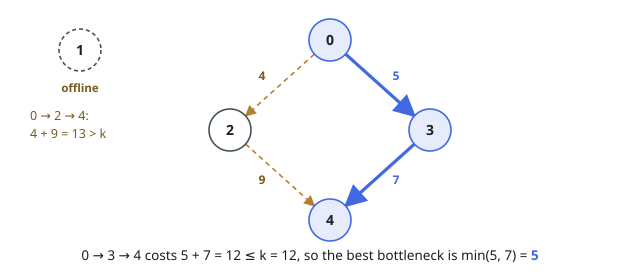
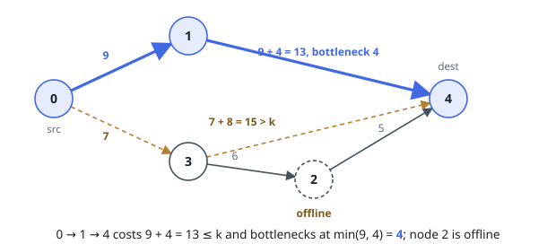

# Best Bottleneck Route Within a Budget

## Description

You are given a directed acyclic graph with `n` nodes numbered `0` to
`n - 1`, listed through `edges[i] = [ui, vi, costi]`, a one-way link from
`ui` to `vi` costing `costi` to use.

Some nodes are out of service. The array `available` records which:
`available[i] = true` means node `i` may be stepped through. The first and
last nodes are always available.

A route from node `0` to node `n - 1` qualifies when every node it steps
through is available and the sum of its edge costs stays within the budget
`k`. A route's bottleneck is the smallest cost among its edges.

Return the largest bottleneck of any qualifying route, or `-1` when no route
qualifies.

### Example 1

```text
Input: edges = [[0,2,4],[2,4,9],[0,3,5],[3,4,7]], available = [true,false,true,true,true], k = 12
Output: 5
Explanation: Node 1 is out of service and has no links anyway. Of the two
routes around the diamond:
  Route 0 -> 2 -> 4: total cost 4 + 9 = 13 > k, over budget.
  Route 0 -> 3 -> 4: total cost 5 + 7 = 12 <= k, qualifying; bottleneck
  min(5, 7) = 5.
So the best bottleneck is 5.
```



### Example 2

```text
Input: edges = [[0,1,9],[1,4,4],[0,3,7],[3,2,6],[2,4,5],[3,4,8]], available = [true,true,false,true,true], k = 13
Output: 4
Explanation: Node 2 is out of service, killing the routes 0 -> 3 -> 2 -> 4
and, with it, the cheap link 2 -> 4. Of what remains:
  Route 0 -> 1 -> 4: total cost 9 + 4 = 13 <= k, qualifying; bottleneck
  min(9, 4) = 4.
  Route 0 -> 3 -> 4: total cost 7 + 8 = 15 > k, over budget.
So the best bottleneck is 4.
```



### Constraints

- `n == available.length`
- `2 <= n <= 5 * 10⁴`
- `0 <= m == edges.length <= min(10⁵, n * (n - 1) / 2)`
- `edges[i] = [ui, vi, costi]`
- `0 <= ui, vi < n`
- `ui != vi`
- `0 <= costi <= 10⁹`
- `0 <= k <= 5 * 10¹³`
- `available[i]` is `true` or `false`, and both `available[0]` and
  `available[n - 1]` are `true`.
- The graph is a directed acyclic graph.

## Hints

### Hint 1

A bottleneck of at least `S` is reachable exactly when some qualifying route
avoids every edge cheaper than `S`. What does that make the search over `S`?

### Hint 2

For one candidate `S`, keep only the edges of cost at least `S` and find the
cheapest total-cost route from `0` to `n - 1` that steps only through
available nodes — the graph is acyclic, so a sweep in topological order
suffices.

### Hint 3

The candidate `S` works when that cheapest total stays within `k`; testing
`S = 0` first separates the no-route-at-all case, which answers `-1`.
