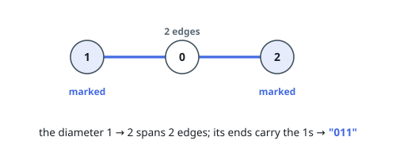
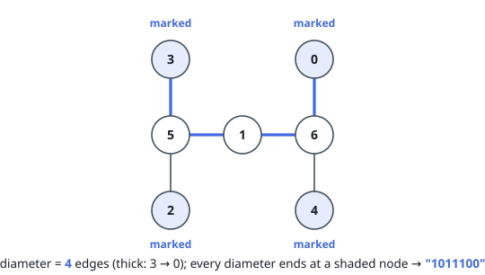

# Mark Diameter Endpoints in a Tree

## Description

You are given a tree with `n` nodes numbered `0` to `n - 1`, described by the
array `edges` of length `n - 1`, where `edges[i] = [ai, bi]` joins nodes `ai`
and `bi`.

A *diameter* is a simple path with as many edges as any path in the tree; a
tree can have several diameters. The ends of a path are its first and last
nodes.

Return a string `s` of length `n` with `s[i] = '1'` when node `i` is an end of
at least one diameter, and `s[i] = '0'` otherwise.

### Example 1

```text
Input: n = 3, edges = [[0,1],[0,2]]
Output: "011"
Explanation:
The tree is the chain 1 - 0 - 2. Its single diameter runs from 1 to 2 across
two edges, so nodes 1 and 2 are marked and the middle node 0 is not.
```



### Example 2

```text
Input: n = 7, edges = [[3,5],[1,5],[1,6],[0,6],[4,6],[2,5]]
Output: "1011100"
Explanation:
The diameter is 4 edges, and four paths achieve it: 3 to 0, 3 to 4, 2 to 0,
and 2 to 4. The marked nodes are 0, 2, 3, and 4 — each terminates at least one
of those paths.
```



### Example 3

```text
Input: n = 5, edges = [[0,1],[0,2],[0,3],[0,4]]
Output: "01111"
Explanation:
Every diameter is a two-edge path from one leaf to another, so each of the
four leaves terminates one. The center lies only in the middle of diameters,
never at an end.
```

### Constraints

- `2 <= n <= 10^5`
- `edges.length == n - 1`
- `edges[i] = [ai, bi]`
- `0 <= ai, bi < n`
- The input is generated such that `edges` represents a valid tree.

## Hints

### Hint 1

From any starting node you pick, the nodes farthest from it always include one
end of a diameter.

### Hint 2

So sweep twice: first from an arbitrary node, then from any node that came out
farthest in the first sweep.

### Hint 3

Keep every tie. A tree with several equally long arms has several diameter
ends on the same side, and dropping ties loses them.

### Hint 4

The union of the two farthest sets — one from each sweep — is exactly the set
of marked nodes.
