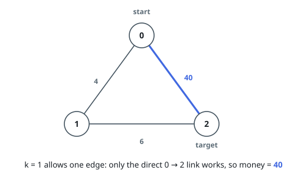
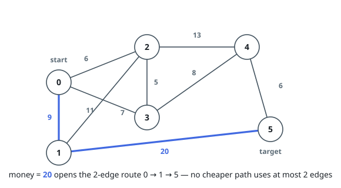
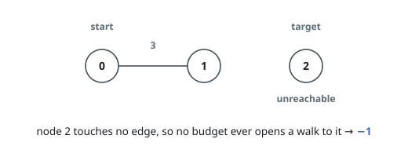

# Smallest Clearing Budget for a Short Route

## Description

An undirected graph on `n` nodes labeled `0` to `n - 1` has `m` edges. Each is
described as `edges[i] = [ui, vi, wi]`: the link between `ui` and `vi`, and
`wi`, the price of opening it. Initially every link is blocked.

Choose a single non-negative integer `money`. Every edge whose clearing cost
is at most `money` becomes passable; every other edge stays blocked.

You must be able to walk from node `0` to node `n - 1` crossing no more than
`k` edges in total.

Return the least `money` that makes such a walk possible, or `-1` if no amount
does.

### Example 1

```text
Input: n = 3, edges = [[0,1,4],[1,2,6],[0,2,40]], k = 1
Output: 40
Explanation:
A walk of one edge from 0 to 2 can only use the direct link, which costs 40.
Routing through node 1 would take two edges, more than k allows.
```



### Example 2

```text
Input: n = 6, edges = [[0,2,6],[2,3,5],[3,4,8],[4,5,6],[0,1,9],[1,5,20],[0,3,7],[1,2,11],[2,4,13]], k = 2
Output: 20
Explanation:
Within two edges, the only walk from 0 to 5 is 0 -> 1 -> 5, so both of its
edges must be passable. The 1 -> 5 link costs 20 — the dearest edge on that
walk — and no smaller amount clears both of its edges.
```



### Example 3

```text
Input: n = 3, edges = [[0,1,3]], k = 1
Output: -1
Explanation:
Node 2 has no incident edge at all, so no amount of money opens a walk to it.
```



### Constraints

- `2 <= n <= 5 * 10^4`
- `1 <= edges.length == m <= 10^5`
- `edges[i] = [ui, vi, wi]`
- `0 <= ui, vi < n`
- `1 <= wi <= 10^9`
- `1 <= k <= n`
- No edge joins a node to itself, and no pair of nodes is joined twice.

## Hints

### Hint 1

Enlarging `money` never removes a passable edge, so "a qualifying walk exists"
can only flip one way — from false to true — as the amount grows.

### Hint 2

For a fixed amount, decide existence with a level-by-level sweep from node `0`
over the passable edges that stops once `k` levels have been crossed.

### Hint 3

Feasibility changes only when an edge enters the passable set, so the answer
is always one of the input weights. Find the smallest workable one by halving
the weight range.
