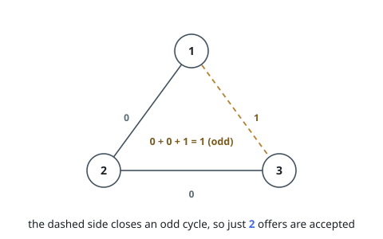
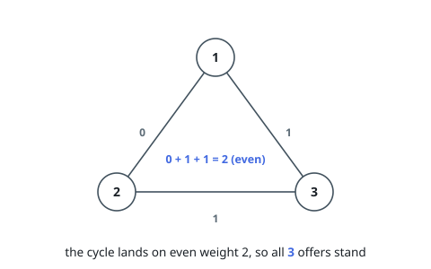

# Keep Every Cycle Even

## Description

You start with `n` isolated nodes labeled `0` to `n - 1`, then receive a list
of edge offers and weigh them one by one, in the order given. The offer
`edges[i] = [ui, vi, wi]` proposes a link between `ui` and `vi` carrying the
weight `wi`, which is either `0` or `1`.

Accept an offer only if, with the link in place, every cycle in the graph has
an even total weight. Otherwise the offer is refused and leaves nothing
behind.

Return the number of accepted offers.

### Example 1

```text
Input: n = 4, edges = [[1,2,0],[2,3,0],[1,3,1]]
Output: 2
Explanation:
[1, 2, 0] and [2, 3, 0] are accepted — no cycle exists yet, so nothing can be
odd. The third offer would close the cycle 1 - 2 - 3 - 1, whose weights total
0 + 0 + 1 = 1, an odd number, so it is refused. (Node 0 receives no offers.)
```



### Example 2

```text
Input: n = 4, edges = [[1,2,0],[2,3,1],[1,3,1]]
Output: 3
Explanation:
The same triangle, with the 2 - 3 link now weighing 1. The closing cycle
totals 0 + 1 + 1 = 2, an even number, so the third offer is accepted too.
```



### Constraints

- `3 <= n <= 5 * 10^4`
- `1 <= edges.length <= 5 * 10^4`
- `edges[i] = [ui, vi, wi]`
- `0 <= ui < vi < n`
- All edges are distinct.
- `wi = 0` or `wi = 1`

## Hints

### Hint 1

Think parity, not sums. Give each node a bit, and read an edge of weight `w`
as the demand that its endpoints differ by exactly `w` — a `0` links
same-labeled nodes, a `1` links oppositely labeled ones.

### Hint 2

Keep a disjoint-set forest that stores, next to each parent link, the XOR of
weights along it. That makes "what is the parity of the path between these two
nodes?" answerable at any moment.

### Hint 3

An offer whose endpoints live in different components closes no cycle — take
it. An offer inside one component is good exactly when the path already there
has the same parity as the offer's weight.
