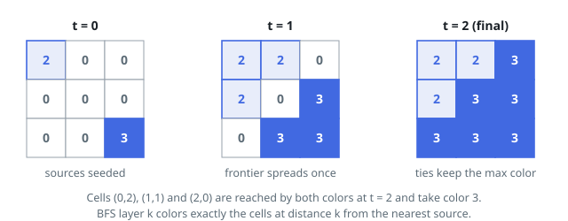

# Solutions — Simultaneous Color Spread

## Multi-Source BFS

Lockstep spreading is what BFS layers already are: a cell's final color is
fixed by the earliest step at which any color reaches it, and when several
arrive on that step the largest value wins. So one queue is seeded with every
source cell at distance 0, each already wearing its color, and the frontier
grows outward on all four sides together.

Popping a cell at distance `d`, each in-bounds neighbor is either unpainted —
it takes distance `d + 1`, inherits the cell's color, and joins the queue —
or it already sits at distance `d + 1`, which means a different color reached
it earlier within this very step; the two values are compared and the larger
kept. That tie update does not re-enqueue, so every cell enters the queue
exactly once.

The quiet point that makes this safe: distances in the queue never decrease,
so any cell still able to lift a neighbor's color sits one layer earlier and
is handled before that neighbor is ever popped. A cell's color is therefore
settled by the time it spreads — its own children inherit the winning shade
even when it won a tie after being enqueued.

Corner cases ride along for free. One source floods the grid with a single
color — under 4-adjacency the grid is one connected region, so the queue only
drains once every cell is painted (Example 3). And the bound
`n * m <= 10^5` keeps the distance array and the queue small no matter how
long and thin the grid is.

**Complexity:** `O(n * m)` time, `O(n * m)` space.
