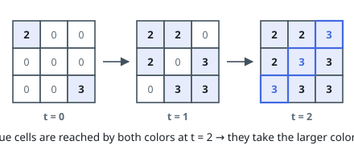
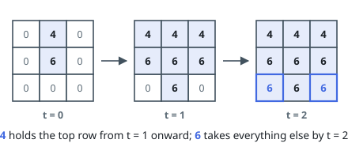
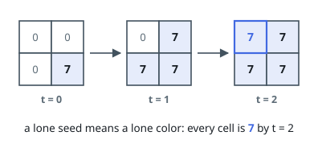

# Simultaneous Color Spread

## Description

A grid of `n` rows and `m` columns begins blank. Some cells are seeded before
anything moves: `sources[i] = [ri, ci, colori]` paints the cell `(ri, ci)`
with `colori`, and every cell not named there holds `0`.

Time then runs in steps. During a step, every painted cell pushes its color
onto its unpainted neighbors — up, down, left, and right — all at the same
instant. A cell that several colors reach in the same step keeps the largest
of them.

The spread stops once no cell can change, and you return the grid as it then
stands.

### Example 1

```text
Input: n = 3, m = 3, sources = [[0,0,2],[2,2,3]]
Output: [[2,2,3],[2,3,3],[3,3,3]]
Explanation:
Colors 2 and 3 start in opposite corners. They meet along the anti-diagonal
during step 2 — the cells (0, 2), (1, 1), and (2, 0) are reached by both at
once — and each of those keeps the larger color 3.
```



### Example 2

```text
Input: n = 3, m = 3, sources = [[0,1,4],[1,1,6]]
Output: [[4,4,4],[6,6,6],[6,6,6]]
Explanation:
The seed 4 sits directly above the seed 6. During step 1, color 4 finishes
the top row before 6 can arrive there, so the row stays 4; everything closer
to 6 falls to it, and the bottom row completes at step 2.
```



### Example 3

```text
Input: n = 2, m = 2, sources = [[1,1,7]]
Output: [[7,7],[7,7]]
Explanation:
With one seed there is one color: 7 covers the whole grid within two steps.
```



### Constraints

- `1 <= n, m <= 10^5`
- `1 <= n * m <= 10^5`
- `1 <= sources.length <= n * m`
- `sources[i] = [ri, ci, colori]`
- `0 <= ri <= n - 1`
- `0 <= ci <= m - 1`
- `1 <= colori <= 10^6`
- No two sources name the same cell.

## Hints

### Hint 1

Everything advances one square per step, in lockstep — which is precisely the
meaning of a layer in a breadth-first search.

### Hint 2

Seed a single queue with every painted cell at distance zero, each already
carrying its color.

### Hint 3

Grow the frontier one full layer per round, in the four directions.

### Hint 4

When one layer delivers several colors to the same cell, keep the larger
value.
