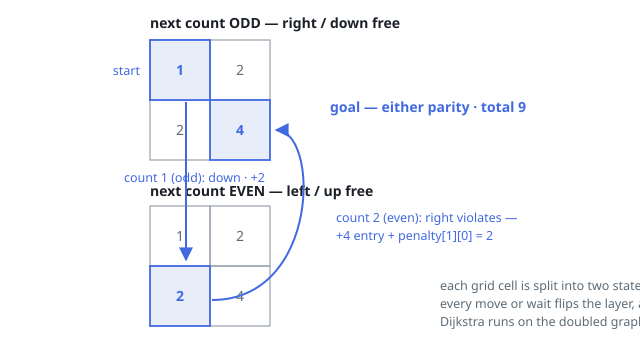

# Solutions — Cheapest Parity-Ruled Grid Walk

## Dijkstra with Parity States

Under the parity rule, where you stand is only half the story — which kind of
count comes next decides what anything costs. So the search runs over states
`(cell, parity)`, with `parity` telling whether the next count is odd (right
or down at no extra charge) or even (left or up at no extra charge). It opens
at `(0, 0)` with the up-front entry price of `1` and parity "next count odd",
because counts begin at 1; every move or standstill then turns the parity
over.

State `(i, j, parity)` offers five choices: the four neighbors plus standing
still. A move costs just the destination's entry price `(ni + 1) * (nj + 1)`
when its direction agrees with the parity, and that price plus `penalty[i][j]`
— charged on the cell being left — when it does not. Standing still costs
`penalty[i][j]` and is the pacing tool: flipping the parity in place is
worth it whenever a modest penalty buys rule-abiding moves afterwards, as in
Example 2, where a free standstill converts a costly violation into two clean
moves. All prices are at least zero, so Dijkstra with a min-heap returns exact
distances across the `2 * m * n` states; stale heap entries are dropped by
checking the recorded distance, and the goal cell needs no expansion once
popped.

The answer is the smaller of the two distances recorded at `(m - 1, n - 1)` —
arriving is enough, whatever parity comes next, because the walk simply stops
there. The bound `m * n <= 10^5` caps the state graph at `2 * 10^5` nodes with
five edges out of each, well within Dijkstra's reach even when `m` or `n`
alone is as large as `10^5`.

**Complexity:** `O(m * n * log(m * n))` time, `O(m * n)` space.
