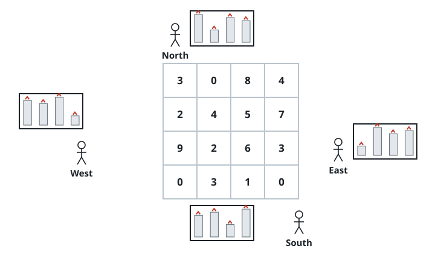

# Fixed Skyline Growth

## Description

A square city has one vertical-prism building in each cell of an `n x n`
matrix `grid`, where `grid[r][c]` is that building's height. Looking across
a row or column from either direction shows only the tallest height in that
row or column, respectively.

You may raise any buildings by any nonnegative amounts, including buildings
that start at height `0`. Find the greatest possible total height increase
such that every row and column silhouette remains exactly the same.

### Example 1



```text
Input: grid = [[3,0,8,4],[2,4,5,7],[9,2,6,3],[0,3,1,0]]
Output: 35
Explanation: One maximum-height-preserving result is
[[8,4,8,7],[7,4,7,7],[9,4,8,7],[3,3,3,3]].
```

### Example 2

```text
Input: grid = [[1,2],[3,4]]
Output: 1
```

### Constraints

- `n == grid.length`
- `n == grid[r].length`
- `2 <= n <= 50`
- `0 <= grid[r][c] <= 100`
