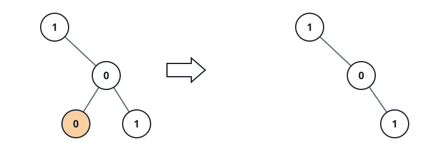
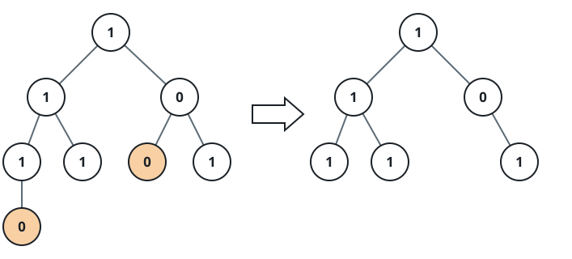

# No-One Subtree Drop

## Description

A binary tree is given through its `root`. Remove every subtree whose nodes
are all `0` — a subtree of a node is that node together with all of its
descendants — and return the root of the remaining tree.

A node is kept if its own value is `1`, or if anything remains below it.

### Example 1



```text
Input: root = [1,null,0,0,1]
Output: [1,null,0,null,1]
Explanation: The lone 0 leaf inside the right branch is a subtree with no 1
in it, so it is the only node removed.
```

### Example 2


```text
Input: root = [1,0,1,0,0,0,1]
Output: [1,null,1,null,1]
```

### Example 3



```text
Input: root = [1,1,0,1,1,0,1,0]
Output: [1,1,0,1,1,null,1]
```

### Constraints

- The number of nodes in the tree is in the range `[1, 200]`.
- `Node.val` is either `0` or `1`.
