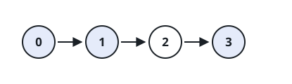
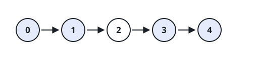

# Selected List Runs

## Description

You receive the head `head` of a singly linked list whose node values are all
distinct, plus an array `nums` containing a subset of those values. Count the
maximal consecutive stretches of list nodes whose values occur in `nums`.

For example, if a selected stretch contains adjacent nodes with values `4`,
`7`, and `9`, it counts as one run rather than three. A node not selected by
`nums` separates runs.

### Example 1



```text
Input: head = [0,1,2,3], nums = [0,1,3]
Output: 2
Explanation: The selected nodes form the runs [0, 1] and [3].
```

### Example 2



```text
Input: head = [0,1,2,3,4], nums = [0,3,1,4]
Output: 2
Explanation: The two selected runs are [0, 1] and [3, 4].
```

### Constraints

- Let `n` be the number of nodes in the linked list.
- `1 <= n <= 10⁴`
- `0 <= Node.val < n`, and all node values are distinct.
- `1 <= nums.length <= n`
- `0 <= nums[i] < n`, and all values in `nums` are distinct.
