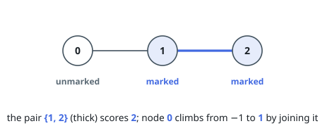
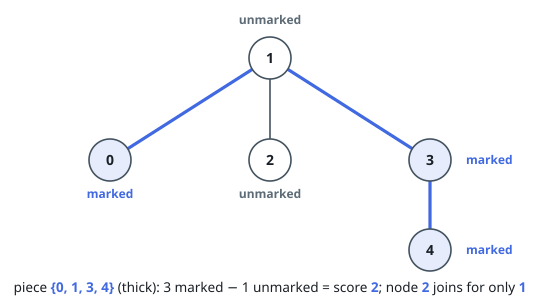
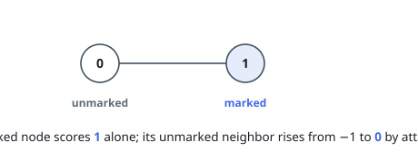

# Best Connected Piece Through Each Node

## Description

You are given a tree on `n` nodes numbered `0` to `n - 1`, described by the
array `edges` of length `n - 1`, where `edges[i] = [ai, bi]` joins nodes `ai`
and `bi`.

Every node carries a mark or the absence of one: `marked[i]` is `1` when node
`i` is marked and `0` otherwise.

The score of a node set is its count of marked nodes minus its count of
unmarked ones. A _piece_ is a set of nodes together with some of the tree's
edges; the piece is connected when its nodes can reach one another using only
its own edges.

For every node `i`, determine the highest score of a connected piece that
contains `i`, and return all `n` of these answers as an array.

### Example 1

```text
Input: n = 3, edges = [[0,1],[1,2]], marked = [0,1,1]
Output: [1,2,2]
Explanation: Nodes 1 and 2 take the piece {1, 2} — two marked nodes, no
unmarked ones, score 2. Node 0 scores -1 on its own, so joining the pair at
score 1 is still its best option.
```



### Example 2

```text
Input: n = 5, edges = [[1,0],[1,2],[1,3],[3,4]], marked = [1,0,0,1,1]
Output: [2,2,1,2,2]
Explanation: The piece {0, 1, 3, 4} has three marked nodes and one unmarked
one, for a score of 2 — the best reachable for nodes 0, 1, 3, and 4. Node 2
scores -1 alone, and the only way up is the whole set, at 3 - 2 = 1.
```



### Example 3

```text
Input: n = 2, edges = [[0,1]], marked = [0,1]
Output: [0,1]
Explanation: The marked node keeps score 1 by standing alone. The unmarked
node scores -1 by itself and 0 beside its neighbor, so it takes the pair.
```



### Constraints

- `2 <= n <= 10^5`
- `edges.length == n - 1`
- `edges[i] = [ai, bi]`
- `0 <= ai, bi < n`
- `marked.length == n`
- `0 <= marked[i] <= 1`
- The edges describe a valid tree.

## Hints

### Hint 1

Reading `marked` as a weight of `+1` and its absence as `-1` turns every
piece's score into a plain weight sum — now it is a maximum-weight problem on
a tree.

### Hint 2

Root the tree anywhere and sweep it bottom-up: for each node, the best score
of a piece that stays inside its own subtree and contains the node.

### Hint 3

Sweep back down, rerooting: hand each child the best piece that reaches it
from the parent side while excluding its own subtree, so both halves of the
tree are visible to every node.
