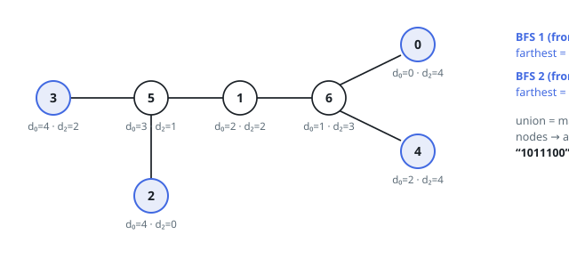

# Solutions — Mark Diameter Endpoints in a Tree

Both methods stay linear by refusing to measure paths directly — each keeps
the right distances and lets the marking fall out. The double BFS leans on a
graph fact: sweep from any start and the farthest set collected is one side's
diameter ends, so two sweeps from lucky sources cover both sides. The
rerooting DP roots the tree once and works out every node's eccentricity — a
down pass for the heights below each node, an up pass for the escape through
its parent — then marks where that eccentricity equals the diameter; heavier
bookkeeping, but it answers for every node at once instead of two hand-picked
sources.

## Double BFS

The whole method hangs on one tree fact: start a breadth-first sweep anywhere,
and every node that ties as farthest from the start terminates some diameter.
The first sweep therefore collects the entire farthest set rather than a single
champion — each member is a legitimate diameter end on the far side of the
tree relative to where the sweep began. Ties are the point: a tree with
several equal arms has several ends on that side, and keeping them all is the
only way not to lose answers.

A second sweep then runs from any node `u` in that first set. Because `u` is
itself a diameter end, the largest distance this sweep records is the diameter
`D`, and every node sitting exactly `D` away from `u` is the opposite end of a
diameter. Marking the union of the two farthest sets and printing one
character per node produces the answer string.

Mechanically, each sweep is an adjacency walk with a list as its FIFO queue,
a `dist` array, and a running maximum; the helper hands back every index whose
distance equals that maximum, which absorbs all ties for free. Each node
enters the queue once per sweep. The odd cases need nothing extra: in the
star of Example 3 the first sweep from the center returns all four leaves, the
second sweep from one leaf returns the other three, and the union is the four
marked leaves.

**Complexity:** `O(n)` time, `O(n)` space.

## Rerooting Eccentricity DP

A node terminates a diameter exactly when nothing sits farther from it than
the diameter's own length — when its eccentricity `ecc(v)` equals the tree's
maximum `D`. So the method computes every eccentricity in one rooted pass and
marks the nodes that tie the maximum.

The tree is rooted at node `0` and swept once for a BFS order with parents;
the order lets both passes run iteratively, parents before children one way
and children before parents the other, so recursion depth never bites at
`n = 10^5`. The down pass walks the order backwards, filling `down[v]` — the
height of `v`'s subtree — from each child's final value; riding along, every
parent keeps its top two child chains and which child owns the best. The up
pass walks forward: `up[v]` is the longest path leaving `v`'s subtree through
its parent, one edge plus the better of the parent's upward reach and its best
sibling arm. Here the second-best chain earns its keep — when `v` itself owns
the parent's best arm, the route into that arm is blocked at `v`'s own
subtree, and the sibling arm must stand in. With `ecc(v) = max(down[v],
up[v])` covering both directions, the marked nodes are exactly those whose
eccentricity equals the running maximum.

Example 2's tree shows the machinery paying off: node `5` has `down = 1` but
`up = 3`, its longest escape running through the center, so its eccentricity
of `3` falls short of `D = 4` while leaves `0`, `2`, `3`, and `4` all tie the
maximum. Unlike the two sweeps — which only ever see distances from two chosen
sources — this pass knows every node's farthest distance, at the price of the
extra top-two and parent bookkeeping.

**Complexity:** `O(n)` time, `O(n)` space.
