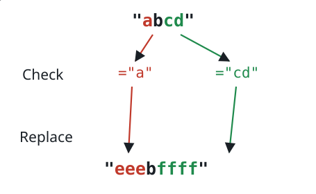
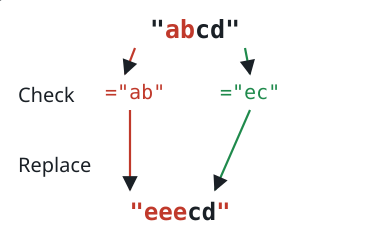

# Simultaneous Text Substitution

## Description

You are given a string `s` and three parallel arrays `indices`, `sources`,
and `targets`, each of length `k`. Operation `i` examines the original string
at position `indices[i]`. If `sources[i]` begins there, replace that matching
text with `targets[i]`; otherwise, leave that position unchanged.

All operations are evaluated against the original `s` and take effect at the
same time, so one replacement never changes another operation's index. The
input guarantees that successful replacement spans do not overlap. Return the
resulting string.

### Example 1



```text
Input: s = "abcd", indices = [0, 2], sources = ["a", "cd"], targets = ["eee", "ffff"]
Output: "eeebffff"
Explanation: Both source strings match at their designated positions, so both
substitutions are applied.
```

### Example 2



```text
Input: s = "abcd", indices = [0, 2], sources = ["ab", "ec"], targets = ["eee", "ffff"]
Output: "eeecd"
Explanation: Only "ab" matches at its given index; "ec" does not match at
index 2 in the original string.
```

### Constraints

- `1 <= s.length <= 1000`
- `k == indices.length == sources.length == targets.length`
- `1 <= k <= 100`
- `0 <= indices[i] < s.length`
- `1 <= sources[i].length, targets[i].length <= 50`
- `s`, every `sources[i]`, and every `targets[i]` use only lowercase English
  letters.
