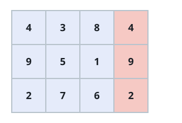
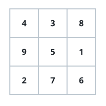
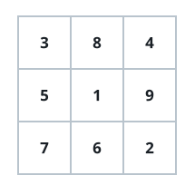

# Grid Magic Block Count

## Description

A `3 x 3` magic block contains each integer from `1` through `9` exactly
once, and all three rows, all three columns, and both diagonals have an
equal sum.

Given an integer matrix `grid`, count how many of its contiguous `3 x 3`
subgrids are magic blocks. Although a valid block only uses values `1`
through `9`, other cells in `grid` may range from `0` through `15`.

### Example 1







```text
Input: grid = [[4,3,8,4],[9,5,1,9],[2,7,6,2]]
Output: 1
Explanation: The left `3 x 3` region is magic: it contains 1 through 9 once
and every required line totals 15. The right region is not magic.
```

### Example 2

```text
Input: grid = [[1,2,3],[4,5,6]]
Output: 0
Explanation: The grid is only two rows tall, so it has no `3 x 3` subgrid.
```

### Example 3

```text
Input: grid = [[2,7,6],[9,5,1],[4,3,8]]
Output: 1
Explanation: This single `3 x 3` subgrid uses every value from 1 through 9
and all of its rows, columns, and diagonals sum to 15.
```

### Constraints

- `row == grid.length`
- `col == grid[i].length`
- `1 <= row, col <= 10`
- `0 <= grid[i][j] <= 15`
