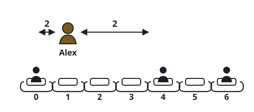

# Furthest Open Seat

## Description

A row is represented by `seats`, where `1` marks an occupied seat and `0`
marks an open one. Choose one open seat to maximize its distance from the
nearest occupied seat. Distance is the absolute difference between seat
indices.

Return that greatest possible nearest-person distance. The row always contains
at least one occupied seat and at least one open seat.

### Example 1



```text
Input: seats = [1,0,0,0,1,0,1]
Output: 2
Explanation: Seat 2 is two positions from its nearest occupied neighbor, and
no other open seat is farther from the closest person.
```

### Example 2

```text
Input: seats = [0,0,1,0,0]
Output: 2
Explanation: Either endpoint is two seats from the person in the middle.
```

### Example 3

```text
Input: seats = [1,0,1,0,0,0]
Output: 3
```

### Constraints

- `seats` has between `2` and `2 * 10⁴` entries.
- Every entry is either `0` or `1`.
- There is at least one `0` and at least one `1`.
