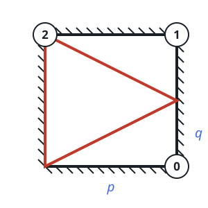

# Reflected Beam Receiver

## Description

A square chamber has side length `p` and mirrors on every wall. A beam begins
at its southwest corner. Three receivers occupy the other corners: receiver
0 is southeast, receiver 1 is northeast, and receiver 2 is northwest.

The beam initially heads toward the east wall and would meet it `q` units
above receiver 0 if that wall were not mirrored. It reflects perfectly from
the walls. Return the label of the first receiver reached. Every test case is
guaranteed to reach a receiver.

### Example 1



```text
Input: p = 2, q = 1
Output: 2
Explanation: After reflection, the beam first arrives at the northwest
receiver.
```

### Example 2

```text
Input: p = 4, q = 3
Output: 2
```

### Example 3

```text
Input: p = 6, q = 4
Output: 0
```

### Constraints

- `1 <= q <= p <= 1000`
