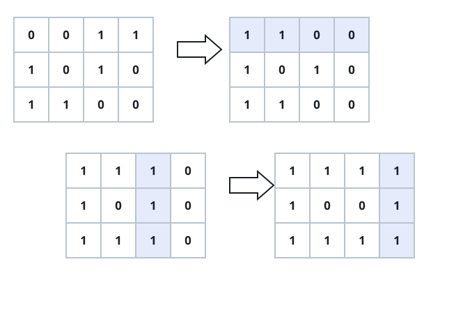

# Binary Matrix Flip Score

## Description

`grid` is an `m x n` matrix of bits. In one move, choose any row or column
and invert every bit in it. You may use any number of moves.

After the moves, read each row as a binary integer whose leftmost position is
the highest-order bit. The matrix score is the sum of those row values.
Return the greatest score obtainable.

### Example 1



```text
Input: grid = [[0,0,1,1],[1,0,1,0],[1,1,0,0]]
Output: 39
Explanation: Inverting the first row and then the two rightmost columns
produces row values 15, 9, and 15.
```

### Example 2

```text
Input: grid = [[1,0,0],[0,1,1]]
Output: 14
```

### Example 3

```text
Input: grid = [[0,1],[1,0],[0,0]]
Output: 8
```

### Constraints

- `m == grid.length`
- `n == grid[i].length`
- `1 <= m, n <= 20`
- Every `grid[i][j]` is either `0` or `1`.
